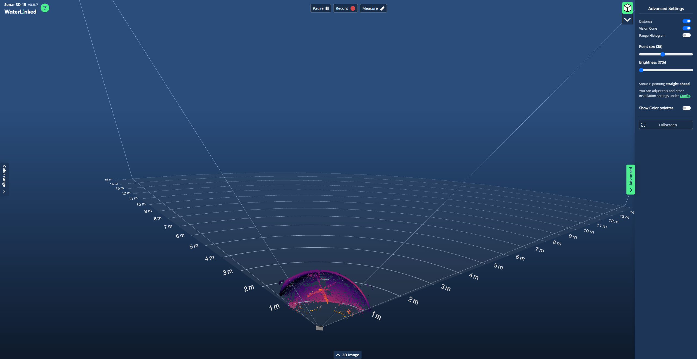
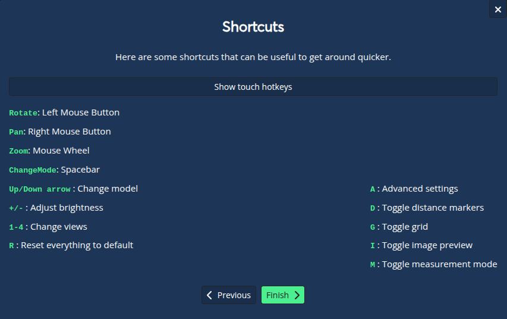
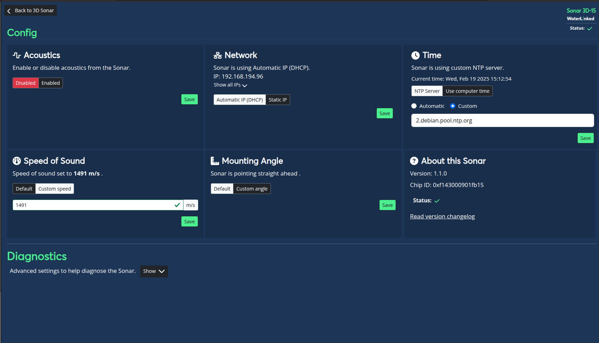
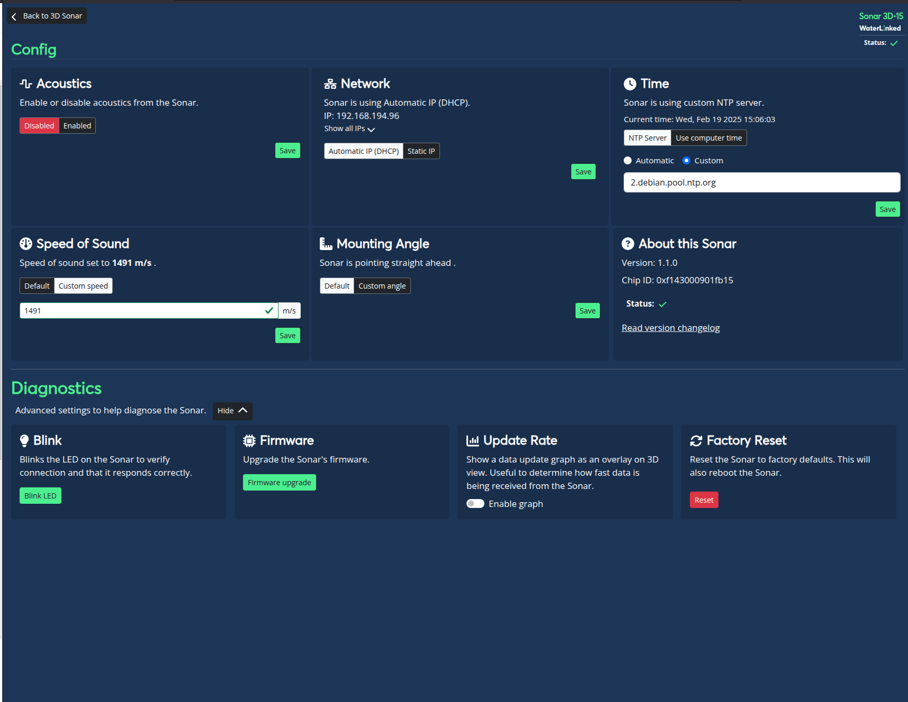

# GUI

The GUI is designed to be user friendly with a clean an intuitive set of controls. Please check out the [Sonar 3D-15 GUI Demo](https://sonar.demo.waterlinked.com/) to explore all the features without the need of an actual Sonar 3D-15!

## Main view

Below you can see the main view that you will be first presented to when accessing the Sonar 3D-15 GUI. 

1. In the middle you can see the 3d image from the Sonar 3D-15
2. Upper left corner shows the version and a help guide by clicking the *?* mark.
3. Upper right corner, let you easily change viewing angle of the 3D image.
4. Upper center, data recording and distance measuring tool.
5. Left center, adjust colors for a better visualization. 
6. Right center, Advanced settings for visualization and a link to other configurations of the Sonar 3D-15.
7. Bottom center, 2D visualization of the 3D image

**Moving the 3D image and shortcuts**

Below you can see how to adjust the 3D image and some hotkeys.

## Config View

Here is the general configuration page of the Sonar 3D-15.

1. Enable/disable acoustics
2. Network config
3. Time config
4. Speed of sound config
5. Mounting angle offset
6. About the Sonar 

### Show diagnostic view

In the same config view you can show diagnostic views which have these feasters.

1. Blink LED
2. Update firmware
3. Show firmware rate in main view
4. Factory reset all settings
