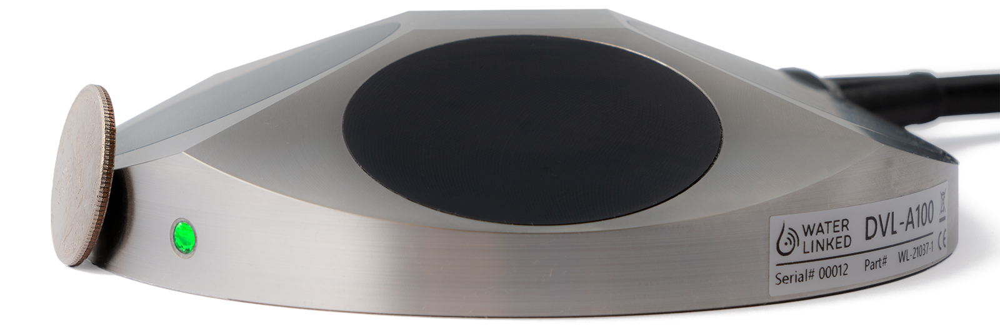
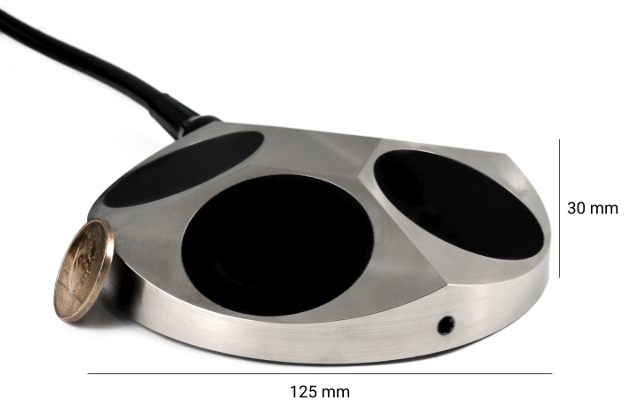

# DVL-A100

## Description
The DVL-A100 is the next step up from the DVL-A50, providing even better performance at greater distances while still keeping a small form factor relative to competing DVLs.

The DVL-A100 builds on the already impressive feats of the DVL-A50 with its increased performance, small 4 beam setup, open interface protocol and mid-to-low cost.

The DVL estimates velocity relative to the sea bottom by sending acoustic waves from the four angled transducers and then measure the frequency shift (doppler effect) from the received echo. By combining the measurements of all four transducers and the time between each acoustic pulse, it is possible to very accurately estimate the speed and direction of movement.

## Key specifications

* 0.05 - 100 meter range
* 420 MHz transducer frequency
* 4-13 Hz ping rate (altitude dependent)
* 4 m/s max velocity
* ± 0.1 cm/s long term accuracy
* 3000 meter depth rating
* 10-30 V input voltage (reversed-polarity protection)
* Ethernet and UART

!!! Note
	The DVL-A100 uses a constant speed of sound equal to 1500 m/s (Release 1.3.1). This is configurable for the Performance edition.

!!! Tip
	Keep the DVL-A100 in a bucket of water to ensure sufficient cooling when doing development with the DVL.

## LED Signals

* No green light: Power is off.

* Flashing green light (slow): DVL loocking for bottom lock.

* Fixed green light: DVL has bottom lock. The LED is mostly on and blinks quickly to show we are alive.

## Wiring interface

The tables below shows the pinning of the DVL-A50 interface.

| Interface           | Color |
| :------------------ | :-- |
| Positive (10-30V)   | Red  |
| Negative/Ground     | Black   |
| ETH TX+             | Orange/White   |
| ETH TX-             | Orange   |
| ETH RX+             | Green/White  |
| ETH RX-             | Green  |
| UART TX             | Brown/White   |
| UART RX             | Brown  |

## Terminal Interface

The DVL-A100 has a 3.3 volt UART interface (5V tolerant).

| Settings            | Value |
| :------------------ | :-- |
| Baud rate | 115200  |
| Data parity stop    | 8N1   |
| Flow control        | None  |

Description of the [serial protocol](./dvl-protocol.md).

## Ethernet Interface

Description of the [ethernet services](./dvl-a50-details.md#ethernet-interface).

<!--
## Libraries and code examples

Example code and libraries that can be used to communicate with the DVL on the terminal interface:

* [Python](https://github.com/waterlinked/dvl-python)
 -->

## Dimensions

## Mounting Holes

## Other details

See [details](./dvl-a100-details.md) for description of axis conventions, transducer numbering and other details.

## Datasheet

[Datasheet](https://www.waterlinked.com/datasheets/dvl-a100/)
