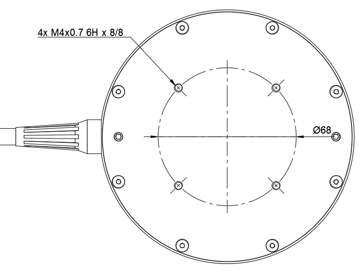

# DVL A125

[Buy DVL A125 here](https://waterlinked.com/product/dvl-a125/)

## Description
The [DVL A125](https://www.waterlinked.com/dvl/dvl-a125) is the next step up from the [DVL A50](https://www.waterlinked.com/dvl/dvl-a50), providing better performance at greater distances while still keeping a small form factor relative to competing DVLs.

The DVL A125 builds on the DVL A50 with increased performance, a small 4-beam setup, an open interface protocol, and mid-to-low cost.

!!! tip
    Keep the DVL A125 in a bucket of water to ensure sufficient cooling when using the DVL on a workbench.

## Dimensions

### Cable dimensions
Delivered cable length: 3.0 m

Cable diameter: 7.8 mm +/- 0.2 mm

## Mounting holes

## Transducer numbering

Mechanical drawings number the transducers from 1 to 4. Protocol messages and diagnostic logs use zero-based transducer `id` values from 0 to 3. See [Transducer numbering and protocol IDs](axes.md#transducer-numbering-and-protocol-ids).

## Transducer beam width

Half-power beam width is 4.1°

## Line of sight

## Datasheet

[Datasheet](https://waterlinked.com/dvl-a125#Downloads-%2F-Resources%E2%80%8B)
