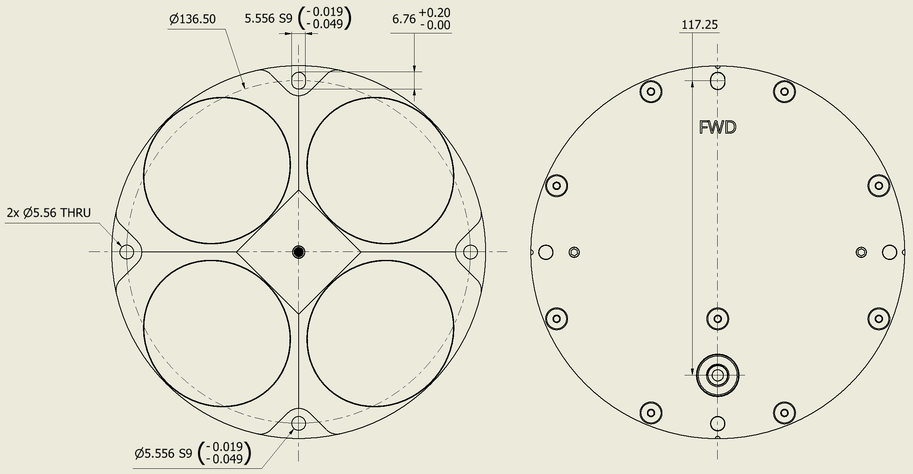
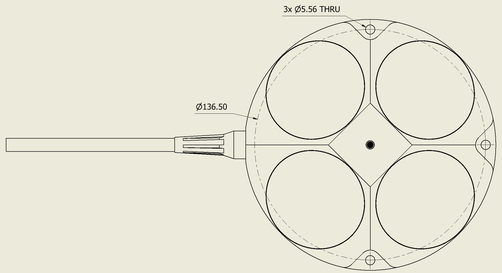

# DVL A250

The [DVL A250](https://www.waterlinked.com/dvl/dvl-a250) is the most capable DVL in the lineup, delivering long-range performance while maintaining a compact and efficient design.

Operating at lower frequency for extended reach, the A250 enables reliable velocity measurements at distances up to 250 m, making it suitable for demanding subsea operations.

The DVL A250 combines high performance, a compact 4-beam setup, open interface protocol, and a competitive cost, making it a powerful solution for larger vehicles and deep-water applications.

<!-- TODO: Add product image of DVL A250. -->

## Dimensions and FOV

Use the mechanical information together with the common [Installation](installation.md) guidance. Verify dimensions, mounting hole placement, cable routing, and line of sight against the latest product drawing or datasheet.

### Dimensions

* **Diameter**: 149 mm
* **Height**: 40 mm
* **Weight in air**: 1.65 kg
* **Weight in water**: 0.75 kg
* **Depth rating**: 4,000 m for side-entry cable configuration; rear O-ring interface version rated to 1,000 m
* **Material**: PEEK (housing), Stainless Steel 316 (back plate)

Use the drawings below as mechanical reference for the two A250 interface variants.

### Rear O-ring interface version

### Side cable entry version

### Cable dimensions

<!-- TODO: Add A250 cable dimensions, including side-entry and rear-entry variants if they differ. -->

The DVL A250 is available with side-entry cable and rear O-ring interface options. A Seacon connector option is available for side-entry versions only.

## Mounting holes

Use a rigid mount so the DVL moves with the vehicle or boat. Avoid flexible poles, unsupported brackets, and mounts that can vibrate.

Use the mechanical drawings above as the reference for mounting-hole placement.

## Transducer numbering

Transducer numbering is useful when comparing web GUI or protocol diagnostics with the physical installation.

Mechanical drawings number the transducers from 1 to 4. Protocol messages and diagnostic logs use zero-based transducer `id` values from 0 to 3. See [Transducer numbering and protocol IDs](axes.md#transducer-numbering-and-protocol-ids).

<!-- TODO: Add DVL A250 transducer numbering drawing. -->

## Transducer beam geometry

Keep all beam paths unobstructed. Avoid mounting locations where brackets, frames, skids, cables, thrusters, propellers, or hull structures can intersect the beam paths.

<!-- TODO: Add DVL A250 transducer beam geometry drawing. -->
Half-power beam width is 22.5°

## Line of sight

The DVL needs a clear acoustic path to the seabed or another reflecting surface. Strong turbulence, bubbles, vibration, and operation very close to the surface can reduce signal quality or cause loss of bottom lock.

For boat-mounted installations, consider the flow around the hull and avoid positions where bubbles or aerated water pass across the transducers. For ROV/AUV installations, avoid mounting directly in thruster wash or near moving parts.

<!-- TODO: Add DVL A250 line-of-sight drawing. -->

## Datasheet

[Datasheet](https://www.waterlinked.com/web/content/108461?unique=7dbba77aaa00fa0f5a38e5d998abe18965f4ddbe&download=true)
