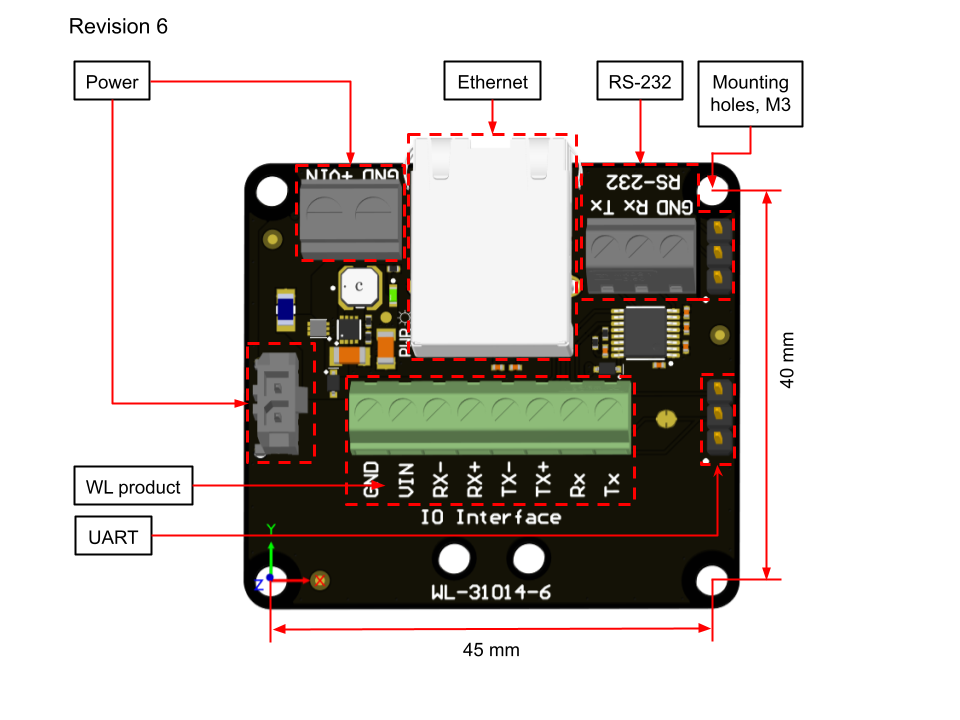

##  I/O interface

The I/O Interface provides a simple means of connection to Water Linked products. It provides power and connection interfaces for Water Linked sensors during development. 

It utilizes the Molex Micro-Fit 3.0 power connector (Part number: 436500228). Female connectors are listed under [Mates with Part(s)](https://www.molex.com/en-us/products/part-detail/436500228#mates-with-use-with).

There currently exist multiple revisions of the I/O Interface. Revision 2 and 3 are electrically identical. Revision 4 has an integrated USB-to-UART interface and a micro USB port. Revision 6 has upgraded connection options, including screw terminals and RS-232. 

I/O interfaces have the part number WL-31014-X, where X is the revision number.

### Revision 6

Dimensions: 50.6 x 47 x 18.6 mm (Width x Height x Thickness)

| Connector                                      | Function | Comment       |
| ---------------------------------------------  | :------- | :------------ |
| RJ45 (8P8C)                                    | Ethernet | 10/100 BASE T |
| Screw Terminal or CONN HEADER VERT 3POS 2.54MM | RS 232   |               |
| Molex Micro Fit 3.0 or 5 mm Screw Terminal     | Power    | 10 to 30 VDC  |
