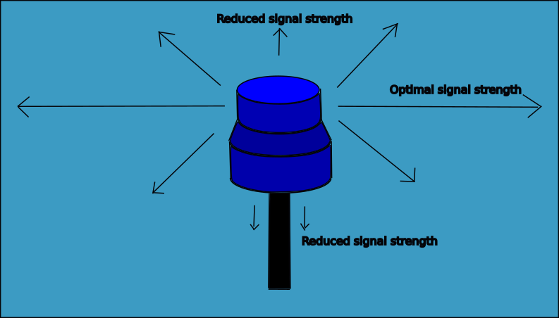

# Modem M16 FAQ

Below are some frequently asked questions about the Modem M16. Click on a question in the table of contents to the right or simply scroll down to read the FAQs.

---

## 1. Can the M16 modem measure the range/distance between two modems?

No, the modem's uses an unsynchronized method of sending data meaning that an time of flight estimate would give large errors in the range estimations. The acoustic signal is not synced but known to be within some time frame of 25ms. 

However if looking at the [Signal to noise ratio (SNR)](../modem-m16/modem-m16-diagnostic-report.md) you can use it to indicate that the distance between the modems is fare or close. For example would a grater SNR (better signal) indicate that it is most likely close as it has so good signal.  

---

## 2. Do the modem retransmit data packets?

<!--  No, the modem do not retransmit data packets. If you need a more robust data link to ensure that packets are received you will have to implement that in your application/driver.  -->

Yes, If the modem is set to parrot mode (see [Parrot Mode](../modem-m16/modem-m16-integration.md#parrot-mode)), it will retransmit all packets it has received.

---

## 3. Does the modem need line of sight to communicate between them?
Yes, they do.

## 4. Can the modem be mounted below a shell on an ROV?
No, the transducer part of the modem must be in the water to be able to send and receive signals.

## 5. How should the modem be mounted to achiecve the best possible signal strength
The signal strength from the Modem-M16 is donut-shaped around the transducer.

Below is a simple scetch that illustrates the signal strength in all directions. For shorter distances the mounting is not relevant, as the signal is transmitted in all directions and also reflected at the surface, seabed or other constructions in the water. On long distances or to achieve optimal behaviour, the mounting position might slightly impact the signal range of the modem. 

