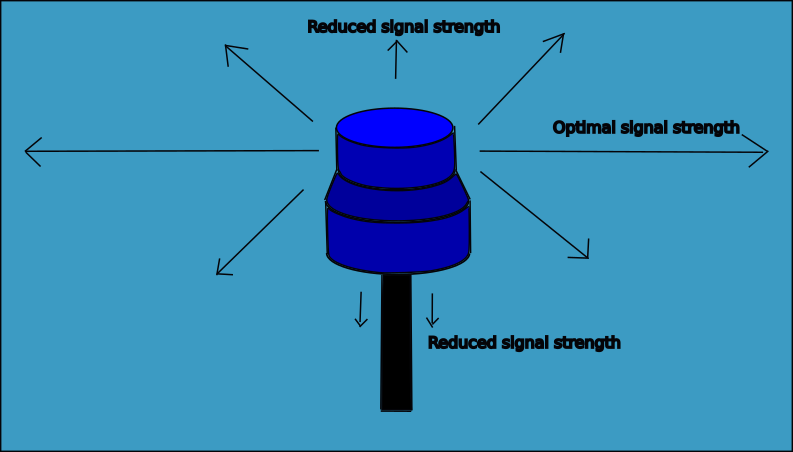

# Modem M16 FAQ

Below are some frequently asked questions about the Modem M16. Click on a question in the table of contents to the right or simply scroll down to read the FAQs.

---

## 1. Can the M16 modem measure the range/distance between two modems?

No. The modems are unsynchronized and the M16 is not designed for time-of-flight
ranging. Range estimates based on its timing will have large errors, for two
reasons:

- **Transmit side:** The exact time of the acoustic transmission is not
  available on the interface. The TX_COMPLETE flag is raised within
  approximately 25 ms after the acoustic transmission, but the exact delay
  varies.
- **Receive side:** The modem decodes packets continuously and does not use a sync word. The
  point where a packet is registered as received is therefore not fixed
  relative to the acoustic arrival, and can vary by up to roughly half the
  duration of the acoustic transmission.

In water, these timing uncertainties correspond to path errors from tens of
metres up to several hundred metres, which makes time-of-flight ranging
impractical.

However, the [Signal to noise ratio (SNR)](../modem-m16/modem-m16-diagnostic-report.md)
can give a rough indication of whether the other modem is near or far: a higher
SNR generally means the modems are closer to each other.

---

## 2. Do the modem retransmit data packets?

<!--  No, the modem do not retransmit data packets. If you need a more robust data link to ensure that packets are received you will have to implement that in your application/driver.  -->

Yes, If the modem is set to parrot mode (see [Parrot Mode](../modem-m16/modem-m16-integration.md#parrot-mode)), it will retransmit all packets it has received.

---

## 3. Does the modem need line of sight to communicate between them?
Yes, they do.

## 4. Can the modem be mounted below a shell on an ROV?
No, the transducer part of the modem must be in the water to be able to send and receive signals.

## 5. How should the modem be mounted to achiecve the best possible signal strength
The signal strength from the Modem-M16 is donut-shaped around the transducer.

Below is a simple scetch that illustrates the signal strength in all directions. For shorter distances the mounting is not relevant, as the signal is transmitted in all directions and also reflected at the surface, seabed or other constructions in the water. On long distances or to achieve optimal behaviour, the mounting position might slightly impact the signal range of the modem. 

## 6. How fast can the modems move relative to each other?
The two modems should not move faster than **0.8 m/s relative to each other**. Above this relative velocity, the Doppler shift of the acoustic signal becomes significant and can disrupt the communication link. See [Acoustics](../modem-m16/modem-m16.md#acoustics).
