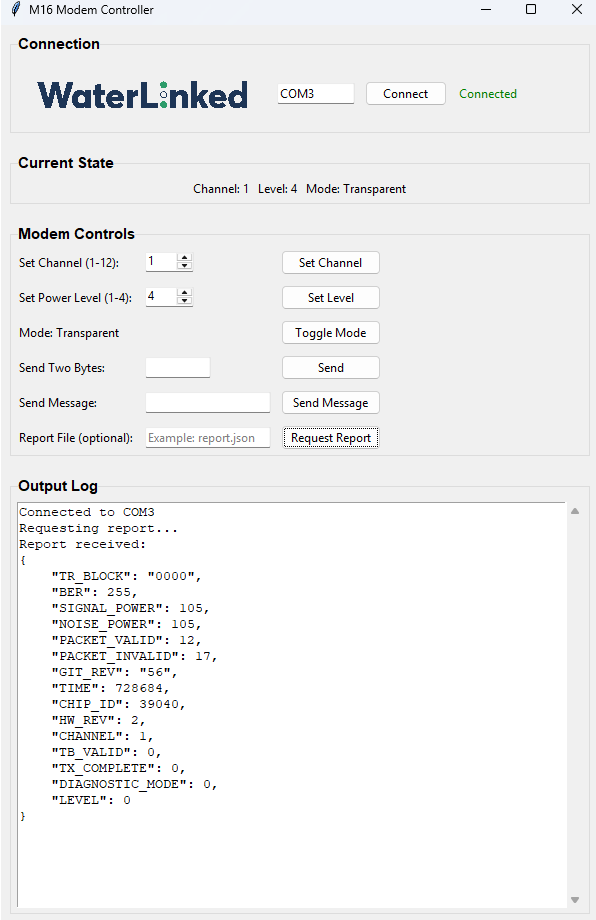

## Basic GUI for easy implementation
For simple operation and tests there is a GUI available for download at:
[github for examples with Modem M16](https://github.com/waterlinked/Modem-M16-Driver)
When you follow the link, in the right menu, under Releases, press "Release 2025.06.12-1045

This executable provides a user-friendly interface to test and verify modem functionality. It demonstrates key features and allows for quick setup and communication testing between modems. Additionally it is a good starting point to get to know the functionality of the modem without Python. The app is a tkinter app that communicates with the modem through m16_driver.py.

### GUI installation for windows:
- Under "Assets", download gui.exe
- If window complains about the security you need to press "more info" and "allow"
- A powershell window will open up - just wait
- The GUI opens up and is ready for use

The default port is set to COM3, the user may need to change this to the appropriate port.

---
### GUI installation for linux:
Follow the installation guide provided in README at [github for examples with Modem M16](https://github.com/waterlinked/Modem-M16-Driver)

---

## GUI layout example:

---