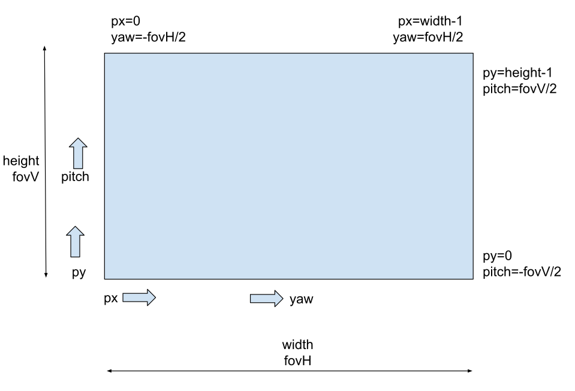

# Integration API Sonar 3D-15

## Introduction
The **Water Linked Sonar 3D-15** provides real-time 3D views of underwater environments using a low-bandwidth **Range Image Protocol (RIP2)**. This protocol efficiently transmits data such as 3D points or grayscale bitmaps over UDP, enabling live visualization, analysis, or archival for later use.

The Sonar 3D-15 also exposes a HTTP API for configuration and inspection of system state.

A Python example implementation of the Sonar API is available on [github](https://github.com/waterlinked/Sonar-3D-15-api-example).

---

## Range Image Protocol (RIP2)

RIP2 is a compact format for range and bitmap images, designed for <10 Mbit bandwidth.

**NOTE**: Some Sonar 3D-15 releases support sending RIP1 packets. RIP1 will be removed in a future release.

### Packet structure

The packet format is designed to fit within a single UDP packet, introducing an upper limit of 65,507 bytes.

This is the structure of a RIP2 packet:

|Number of bytes|Description|
|-|-|
|4|0x82 0x73 0x80 0x50, Identifier which reads "RIP2" in ASCII|
|4|Packet length (including identifier, packet length, payload and checksum)|
|payload length (packet length - 12)|Encoded protobuf message, compressed with [Snappy](https://en.wikipedia.org/wiki/Snappy_(compression))|
|4|IEEE 802.3 CRC-32 of the preceding bytes in the packet|

**Decoding Steps**:

1. Verify the "RIP2" ID.  
2. Read packet length.
3. Read compressed payload and CRC-32, and verify the CRC-32.
4. Decompress the payload into an encoded protobuf packet.
5. Decode into the `Packet` message type (see `.proto` [file](#proto-file-excerpt))
6. Use `.msg.type_url` to identify the contained message.  
7. Decode `.msg.value` into that message type (see `.proto` [file](#proto-file-excerpt))

---

### Network
By default, the Sonar 3D-15 uses **UDP Multicast** (`224.0.0.96:4747`), so any device on the local network can receive RIP2 packets without knowing the sonar’s IP.

The Sonar can also be configured for UDP unicast, or to disable sending of UDP packets. See HTTP API.

---

### Image Sizes and Update Rates
| **Mode**      | **Resolution (W×H)** | **FOV (H×V)** | **Rate** |
|---------------|----------------------|--------------|---------|
| Low Frequency | 256 × 64            | 90° × 40°     | 5 Hz    |
| High Frequency| 256 × 64            | 40° × 40°     | 20 Hz   |

---

### Message Types
RIP2 supports several Protobuf-encoded messages, including:

#### `BitmapImageGreyscale8`
- 8-bit grayscale; each pixel = signal strength or shaded depth.  
- `type` enum differentiates **signal strength** vs. **shaded**.  

#### `RangeImage`
- Each pixel represents distance (radius) to the strongest reflection.
- `0` = no valid data.
- `radius = pixelValue * imagePixelScale`.

---

### Coordinate and Image Conventions
**Axes** (right-handed):

- **Origin**: The point cloud uses a mechanical origin located on the backplate, centered between the mounting screw holes.
- **x**: forward  
- **y**: right  
- **z**: downward  

**Image**:



- Horizontal FOV (`fovH`) spans width.
- Vertical FOV (`fovV`) spans height.
- `(px, py)` maps to `(yaw, pitch)`:
  ```python
  yaw = (px / (width - 1))  * fovH - (fovH / 2)
  pitch = (py / (height - 1)) * fovV - (fovV / 2)
  ```

**Example: Converting Range Image to 3D**:
```cpp
// Convert pixelValue to radius in meters
if (pixelValue == 0) {
  return Undefined; // no valid data
}
radius = pixelValue * imagePixelScale;

// Convert (yaw, pitch) from degrees to radians
yaw   = deg2rad((px / (width - 1))  * fovH - (fovH / 2));
pitch = deg2rad((py / (height - 1)) * fovV - (fovV / 2));

// Cartesian conversion (x forward, y right, z down)
x = radius * cos(pitch) * cos(yaw);
y = radius * cos(pitch) * sin(yaw);
z = -radius * sin(pitch); // z is downward
```

---

### `.proto` File (Excerpt)
```protobuf
// Water Linked Sonar 3D-15 protocol
syntax = "proto3";

package waterlinked.sonar.protocol;
import "google/protobuf/timestamp.proto";
import "google/protobuf/any.proto";

// Packet is the top-level message that is sent over the wire.
message Packet {
  google.protobuf.Any msg = 1; // Use .type_url to deserialize .value 
  // into one of the messages defined in this proto file
}

message Header {
  google.protobuf.Timestamp timestamp = 1;
// Sequence id is a monotonically increasing number that identifies
// each shot of the sonar. It can be used to detect missing shots or
// to relate messages of different types to each other. The value
// wraps around to 0 after reaching the maximum value.

  uint32 sequence_id = 2;
}

enum BitmapImageType {
// Bitmap image showing for each x,y pixel the strength of the
// strongest reflection
SIGNAL_STRENGTH_IMAGE = 0;
// Bitmap image showing a shaded representation of the depth in the
// range image. The light source is behind and above the observer.
// (This is experimental and may be removed in the future)
SHADED_IMAGE = 1;
}

// BitmapImageGreyscale8 can be shown to user without further processing.
// Uncompressed, 8-bit color depth, greyscale.

message BitmapImageGreyscale8 {
  Header header = 1;
  float speed_of_sound = 2; // Configured speed of sound in water in m/s 
  float range = 3; // Configured range in meters
  uint32 frequency = 4; // Configured imaging frequency in Hz
  BitmapImageType type = 5; // Identifier for what is shown in the image
  uint32 width = 6;
  uint32 height = 7;
  float fov_horizontal = 8;
  float fov_vertical = 9;
  // image pixel data is organized in rows of pixels.Each row is
  // 'width' wide, and there are 'height' rows. Each pixel is an 8-bit
  // value that represents the intensity of the pixel, from 0 to 255
  bytes image_pixel_data = 10;
}

// RangeImage measures the distance to the strongest reflection
// for each pixel.
message RangeImage {
  Header header = 1;
  float speed_of_sound = 2; // Configured speed of sound in water in m/s
  float range = 3; // Configured range in meters
  uint32 frequency = 4; // Configured imaging frequency in Hz.
  uint32 width = 5;
  uint32 height = 6;
  float fov_horizontal = 7; // In degrees
  float fov_vertical = 8; // In degrees
  float image_pixel_scale = 9;

  // image_pixel_data is organized in rows of pixels. Each row is
  // 'width' wide, and there are 'height' rows.
  // Each pixel is a 16-bit value that must be multiplied by
  // image_pixel_scale to obtain the distance in meters from the sonar
  // to the strongest reflection in that direction.
  repeated uint32 image_pixel_data = 10;
}
```


**Compatibility Notes**  
- Additional message types/fields may be introduced.  
- Decoders should ignore unrecognized messages.  
- Major breaking changes will involve a new protocol identifier.

Refer to the full protocol specification and `.proto` file shown above for more information.

## HTTP API

The Sonar 3D-15 exposes a HTTP API for configuration and inspection of system state. The HTTP API is exposed on port 80 and uses paths rooted at `/api/v1/integration/`. JSON is used for request and response bodies. The HTTP API is documented with a [swagger.json](./sonar-3d-15-api-swagger/swagger.json) file. This file can be opened in a compatible viewer such as [this one](https://petstore.swagger.io/?url=https://docs.waterlinked.com/sonar-3d/sonar-3d-15-api-swagger/swagger.json). Example code using the HTTP API exists on [github](https://github.com/waterlinked/Sonar-3D-15-api-example).
