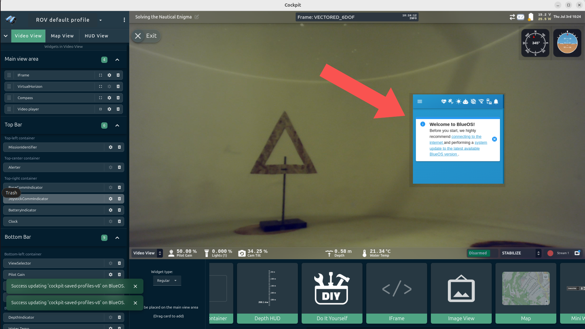

# Integrating onto BlueROV2


---
## Introduction
This is a manual on how to install the Water Linked Sonar 3D-15 for the BlueROV2. Documentation and information about the BlueROV2 can be found at:

- [BlueRobotics Help Center](https://bluerobotics.com/help-center/)
- [BlueRobotics Contact Us](https://bluerobotics.com/contact/)
- [BlueRobotics Technical Reference](https://bluerobotics.com/learn/technical-reference/)

    


---

## What's in the box
The Sonar 3D-15 from Water Linked is normally shipped with an attached I/O Interface board.


---

## What You’ll Need

To follow this guide, you will need the following:

- [BlueROV2 Roof Rack](https://bluerobotics.com/store/rov/bluerov2-accessories/rov-roof-rack/)

- A mount (Sonar 3D-15 to ROV)

    - *An example can be downloaded from here: [3D step file](./stp_files/sonar_mount_1.stp)*

- Correct screws

    - *See the [Mounting](#mounting) section*

- 2 spade connectors *(or ring terminals)*

- A JST 4-pin connector

- WetLink Penetrator 6.5 *(low-compression)*

    - *[WetLink from Blue Robotics](https://bluerobotics.com/store/cables-connectors/penetrators/wlp-vp/)*

- Ethernet Switch board

    - *Make sure you have an Ethernet Switch installed on your BlueROV2. This is needed for the integration of the Sonar 3D-15. The installation guide for the Ethernet Switch can be found here:* [Ethernet Switch Installation Guide from Blue Robotics](https://bluerobotics.com/learn/ethernet-switch-installation-guide-for-the-bluerov2/)


---

## Connector Setup
**Testing the Sonar 3D-15 Separately**

If the I/O Interface board is attached, the Sonar 3D-15 can be tested directly using an Ethernet cable and a power supply. If you wish to test the device on its own before integration, follow the general Quickstart tutorial, available here:  [Quickstart](https://docs.waterlinked.com/sonar-3d/sonar-3d-15-quickstart/).

**Connecting to the BlueROV2**

To connect the Sonar 3D-15 to the BlueROV2, you have to attach connectors to each of the wires from the Sonar 3D-15. You have to make the final cable assembly resemble the images below - with the cable towards the Sonar 3D-15 **on the left** and their JST connectors for the BlueROV2 **on the right**.

{width="49%"}
{width="50%"}


The installation procedure for the Sonar 3D-15 is very similar to the Water Linked DVL installation, which BlueRobotics has an excellent guide for. We recommend reviewing this guide before proceeding. It can be found here: 

[DVL Installation Guide for BlueROV2](https://bluerobotics.com/learn/dvl-a50-integration/#installing-the-water-linked-dvl-extension) 

For the remainder of this Sonar 3D-15 guide, we assume you are familiar with the BlueROV2 and its installation procedures.

--- 

To install the Sonar 3D-15 for the BlueROV2, perform the following procedure:

1. **Remove the I/O board**.  Measure out the required length outside the ROV. Then cut the Sonar cable to that length plus approximately *30cm* for inside the ROV.


    After this step, the I/O board is no longer needed for normal operation. The cables from the Sonar 3D-15 are shown in the picture below.

    {width="60%"}  

    !!! Warning
        The Sonar 3D-15 cable is permanently attached and non-replaceable inside the Sonar 3D-15
        If you cut the cable too short you will either have to splice the cable
        with another cable, or order a new Sonar 3D-15. 
        **Measure twice, cut once!**

2. **Assemble a waterproof WetLink 6.5 LC Penetrator** according to the BlueRobotics guide. It can be found here: *[WetLink Installation Guide from Blue Robotics](https://bluerobotics.com/learn/wetlink-penetrator-installation-guide/)*


3. **Identify the different cables** from the Sonar 3D-15. Make sure to correctly identify the different white signal cables. Differentiate between white/green *(RX+)* and white/orange *(TX+)*.

    | Sonar Cable Type | Sonar Cable Color |
    |------------------|-------------------|
    | DC-              | Black             |
    | DC+              | Red               |
    | RX+              | Green/White       |
    | RX-              | Green             |
    | TX+              | Orange/White      |
    | TX-              | Orange            |

4. **Solder the spade connectors** onto the black and red power cables. 

    {width="60%"}

5. **Terminate a JST 4-pin connector** to the four remaining cables. The order is:

    | Pin Order | Wire Color     | Sonar Cable Type |
    |-----------|----------------|------------------|
    | 1         | Green/White    | RX+              |
    | 2         | Orange/White   | TX+              |
    | 3         | Green          | RX-              |
    | 4         | Orange         | TX-              |


    {width="66%"}
    {width="33%"}

    Make the cables from the Sonar 3D-15 look similar to the following:

    {width="100%"}

6. **Install the WetLink Penetrator into the end cap** of the watertight enclosure. See the *Installing The Penetrator* chapter on Blue Robotics' DVL installation guide for proper penetrator installation: [DVL Installation Guide for BlueROV2](https://bluerobotics.com/learn/dvl-a50-integration/#installing-the-penetrator).


7. **Connect the JST connector** to the Ethernet Switch board on the BlueROV2. Use port 2, 3, or 4 for the JST connector, as port 5 and 1 are occupied.

    {width="59%"}
    {width="40%"}
    

8. **Connect the power spade connectors** of the Sonar 3D-15 cables to the power terminal blocks on the BlueROV2. Connect the black power wire to an available space on the terminal block with the other black wires. Connect the red power wire to and available space on the terminal block with the other red wires.

    {width="49%"}
    {width="49%"}

9. **Seal and waterproof** the connection and BlueROV2 by closing end cap of the watertight enclosure properly.

---

## Mounting
The Sonar 3D-15 needs to be physically attached to the BlueROV2 ROV. A possible option on how to do this will be listed here. There are many different approaches to achieve this, and this approach is only listed to provide an idea.

1. **Create or find a suitable mount**

    An example 3D step file of a mount is found here: [Download 3D step file](./stp_files/sonar_mount_1.stp)
    

    !!! Note
        Choose a 3D print material that can withstand the expected operating conditions.

2. **Identify the screws and mount to use**

    Use `[M4x (5.0 + X) mm]` screws to attach the Sonar 3D-15 to the mount, and use `[M4x (9.0 + X) mm]` screws with hex nuts and washers to attach the mount to the BlueROV2 Roof Rack. Exchange the *X* with the thickness of your mount.

    For example, for a 3.0mm thick mount *(as the given 3D print)*, the following is sufficient:
    
    - 4x `M4x8.0mm` screws
    - 4x `M4x12.0mm` screws
    - 4x `M4` Hex Nuts
    - 4x `M4` Washers  

    

    !!!Warning
        To avoid damaging the Sonar 3D-15, make sure the screws are not too long.

3. **Attach the mount to the Sonar 3D-15**

    


4. **Attach the mounted Sonar 3D-15 to the BlueROV2 ROV**

    We recommend putting the Sonar 3D-15 on the BlueROV2 Roof Rack in the front for the BlueROV2. In that way, the Sonar 3D-15 will not block the Sonar 3D-15’s field of view.

    {width="49%"}
    {width="49%"}
    

!!! note
    Make sure the Sonar 3D-15 and cable are neatly and securely attached before use.
---

## Connection steps


### 1. **Make your ROV ready for launch**

Follow the [BlueROV2 Software Setup](https://bluerobotics.com/learn/bluerov2-software-setup/) guide to make your ROV ready for launch. This shows how to turn on the ROV and what software to install. 

The Sonar 3D-15 will now show a green light, indicating it is powered.

### 2. **Access the Sonar 3D-15 GUI**

The Sonar 3D-15 GUI can be accessed by entering the Sonar 3D-15's IP-address into the browser running on the computer connected to the ROV.

You have to determine which IP-address has been automatically assigned to the Sonar 3D-15 by the BlueRov2 system. Steps to find it follows below. Once located, entering it in your browser will display a page like the one below — in this example, the Sonar 3D-15 is assigned the IP-address `192.168.2.172`. 


!!! Warning
    Don't operate the Sonar 3D-15 out of water for any long periods. To avoid overheating of the Sonar 3D-15, **don’t click the green button “Enable Acoustics”**, until the ROV is submerged in water. 
    
    Acoustics is always disabled when first booting up the Sonar 3D-15, and will be turned on once clicking this button. The Sonar 3D-15 will automatically turn itself off if too hot, but will take some time to cool down, it's best to avoid this happening.


Find the IP-address corresponding to the Sonar 3D-15 on a computer by doing the following:

1. **Find the IP-address of your computer on the BlueROV2 network**

    You need your own network IP-address on the BlueROV2 network. 
    On **Linux** you find it by typing in:

    ```sh
    ip a
    ```
    in the terminal. 
    
    On **Windows** you find it by typing in:
    ```sh
    ipconfig
    ```
    !!!Tip
        It's easier to find your IP-address if your computer is connected only to the BlueROV2 network.


2. **Test and find the Sonar 3D-15's IP-address**

    A quick easy way to see the IP-addresses of the devices on your local network is to use [nmap](https://nmap.org/download.html). Install it for your operating system and go to the terminal and write
    ```sh
    nmap -sn <YOUR_IP>
    ```

    This will scan the BlueROV2 network and show all accessible connected devices and their IPs.

    

    To find the IP-address of the Sonar 3D-15, try the IP-addresses on the list by typing them into the search bar of your browser. 

    - For example, if you have the list above, try `192.168.2.2`, `192.168.2.136`, `192.168.2.172` and so on. You may try them all safely.

    If the Sonar 3D-15 GUI appears, you have found the correct IP-address.

    !!! Tip
        You can also access the GUI on the Sonar 3D-15's fallback address `192.168.194.96`. This method is explained in more detail on the general quickstart guide, which can be found at [Quickstart](https://docs.waterlinked.com/sonar-3d/sonar-3d-15-quickstart/) .

### 3. ***(Optional)* Open Cockpit with the Sonar 3D-15 GUI**

We recommend using **Cockpit**, a new, highly customizable ground control station software from Blue Robotics. More information about Cockpit can be found here: [Cockpit Information](https://discuss.bluerobotics.com/t/cockpit-1-0-0-release/17744), and it can be installed from here: [Install Cockpit](https://github.com/bluerobotics/cockpit/releases/tag/v1.15.2).

Once Cockpit is installed and the BlueROV2 is ready for launch, you will see the Cockpit GUI, as shown in the following picture. Click the **collapse handle** on the left to reveal the GUI options.


Click **Edit Interface**.


Here you can change the layout of the GUI. We will add a frame to display the Sonar 3D-15 GUI. Click and drag an **IFrame** box onto the main screen.


An *IFrame* box will appear with the standard BlueOS page. 



Resize it as needed to fit your desired layout.


Click the **settings icon for the IFrame**.


The following configuration panel will appear.


Instead of `http://blueos-avahi.local`, enter the IP-address for the Sonar 3D-15, as found in the previous step. In this example, the IP-address is `http://192.168.2.172`. Press *Enter* on your keyboard, then close the settings panel.


The Sonar 3D-15 GUI will now appear in the IFrame box within your Cockpit control station.


!!! Warning
    To avoid overheating of the Sonar 3D-15, **don’t click the green "Enable Acoustics" button**, until the ROV is submerged in water. 


### 4. **Put the ROV into water**

You are now ready to put the ROV into water. 


### 4. **Enable acoustics**

When ready, click the ”Enable acoustics” button to initiate the Sonar 3D-15. It will display a 3D point cloud in the GUI representing the area in front of the Sonar 3D-15.


<!-- {width="100%"} -->
{width="100%"}

You are now ready to use the Water Linked Sonar 3D-15 with the BlueROV2!