# Integrating onto Blueye X3 ROV

---
## Introduction
This is a manual on how to install the Water Linked Sonar 3D-15 for the Blueye X3 ROV. We recommend that you contact Blueye to purchase the Sonar 3D-15, along with all parts to allow for installation on your Blueye vehicle. You can contact Blueye at [contact@blueye.no](mailto:contact@blueye.no) or [blueyerobotics.com/contact/sales](https://www.blueyerobotics.com/contact/sales) for this. General documentation and information from Blueye can be found here:

- [Blueye General support](https://support.blueye.no)
- [Blueye X3 ROV User Manual](https://support.blueye.no/hc/en-us/articles/4868560476316-Blueye-X3-User-Manual-PDF)

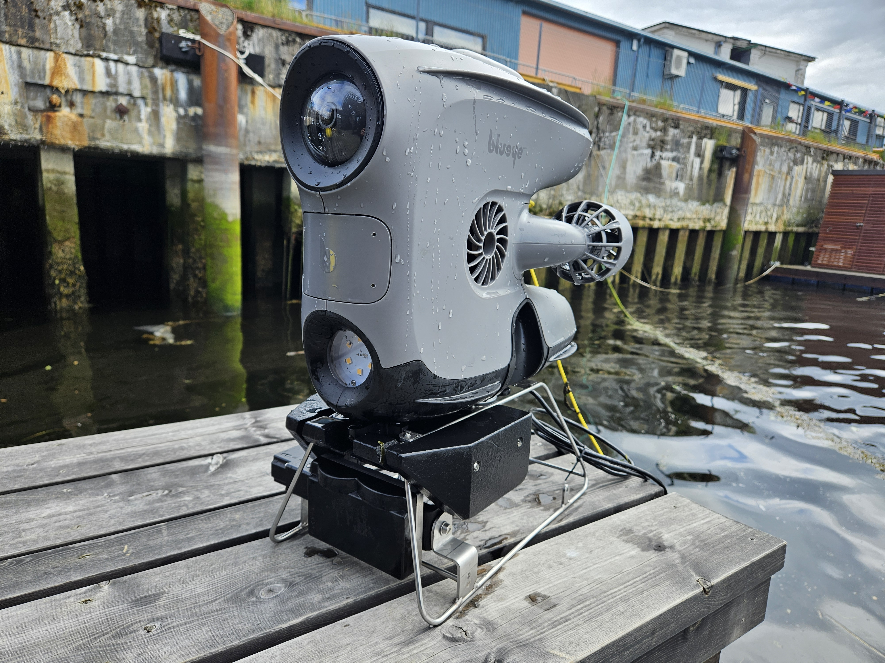

---

## What's in the box

The Sonar 3D-15 from Water Linked is normally shipped with an attached I/O Interface board. However, if you have purchased the Sonar 3D-15 along with the Integration Kit from Blueye, which we recommend, it will include a pre-terminated connector instead of the I/O Interface board. In that case, follow the integration instructions provided by Blueye.

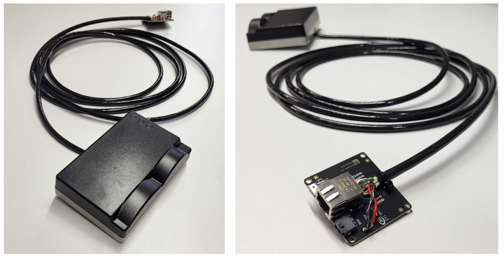

---

## Connector Setup
**Testing the Sonar 3D-15 Separately**

If the I/O Interface board is attached, the Sonar 3D-15 can be tested directly using an Ethernet cable and a power supply. If you wish to test the device on its own before integration, follow the general Quickstart tutorial, available here:  [Quickstart](https://docs.waterlinked.com/sonar-3d/sonar-3d-15-quickstart/).

**Connecting to Blueye ROV**

Please contact Blueye to obtain customized terminations and cables for connecting the Blueye ROV to the Sonar 3D-15. This guide will assume terminated cables provided from Blueye.

---

## Mounting
The Sonar 3D-15 needs to be physically attached to the Blueye ROV. Blueye can provide a custom mount designed to fit the Sonar 3D-15. Please contact Blueye for further details.

1. **Get a suitable mount**

    This is the mount from Blueye, with both space for the Sonar 3D-15 and a servo motor that can change the angle of the Sonar 3D-15 field-of-view.

    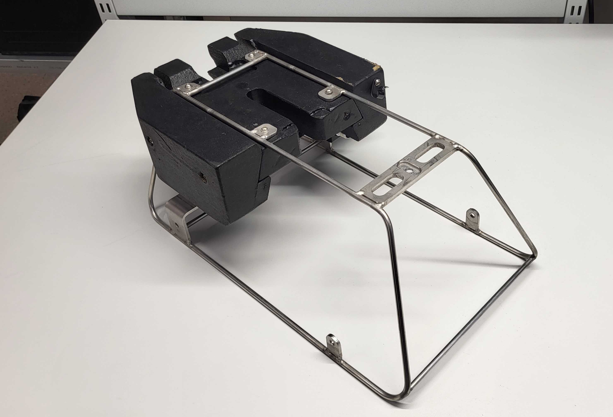{width="49%"}
    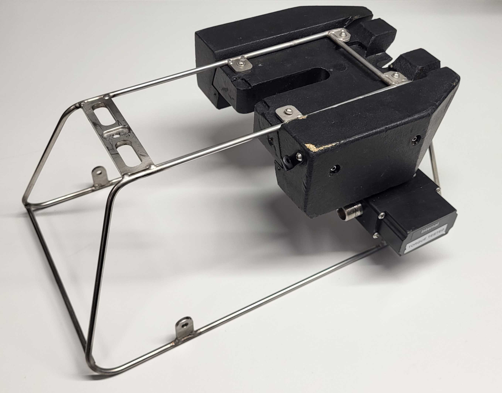{width="43%"}
    

2. **Identify the screws to use**

    Use **M4 × 10 mm (ISO14583 A4)** screws with **M4 (ISO 7089 A4)** washers to attach the Sonar 3D-15 to the mount.

    {width="33%"}

    !!!Warning
        To avoid damaging the Sonar 3D-15, make sure the screws are not too long. In this example, 10 mm long screws with washers are suitable for the mounting setup.

3. **Attach the mount to the Sonar 3D-15**

    {width="49%"}
    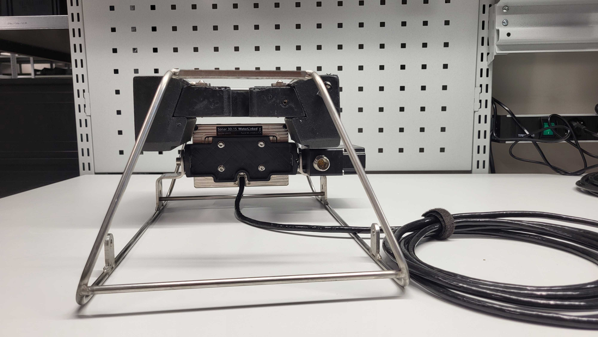{width="49%"}
    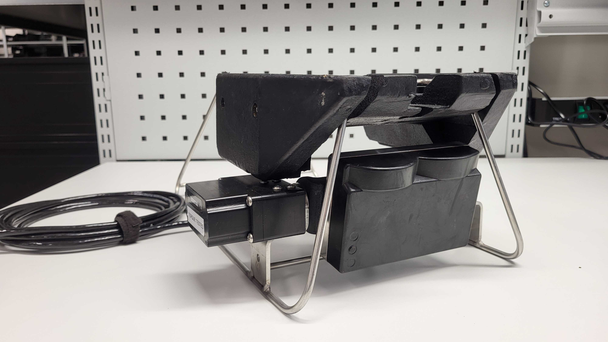{width="49%"}
    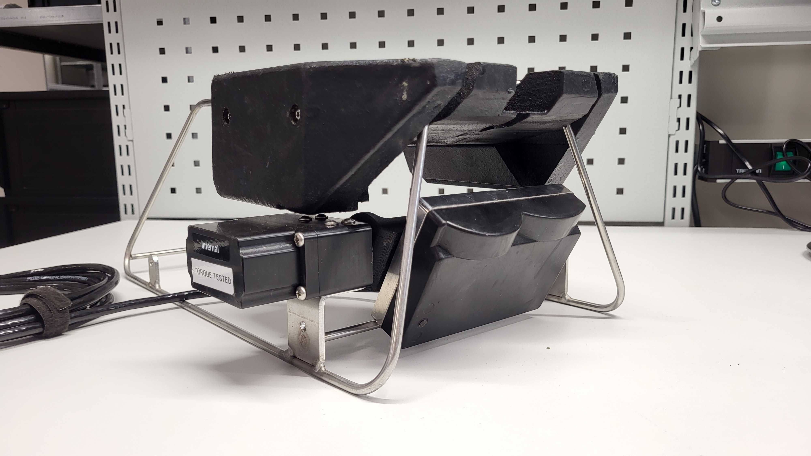{width="49%"}

4. **Attach the mount with the Sonar 3D-15 to the Blueye ROV**

    Use the star knob to attach and tighten the mount to the Blueye.

    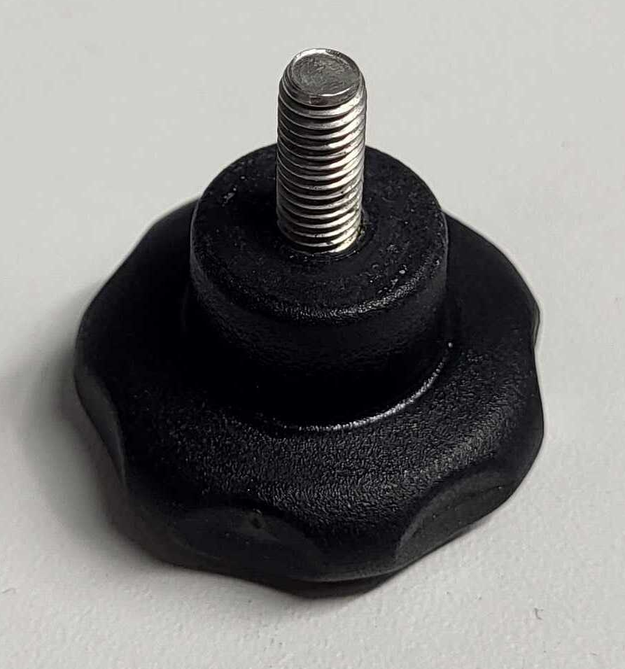{width="34%"}
    {width="64%"}

    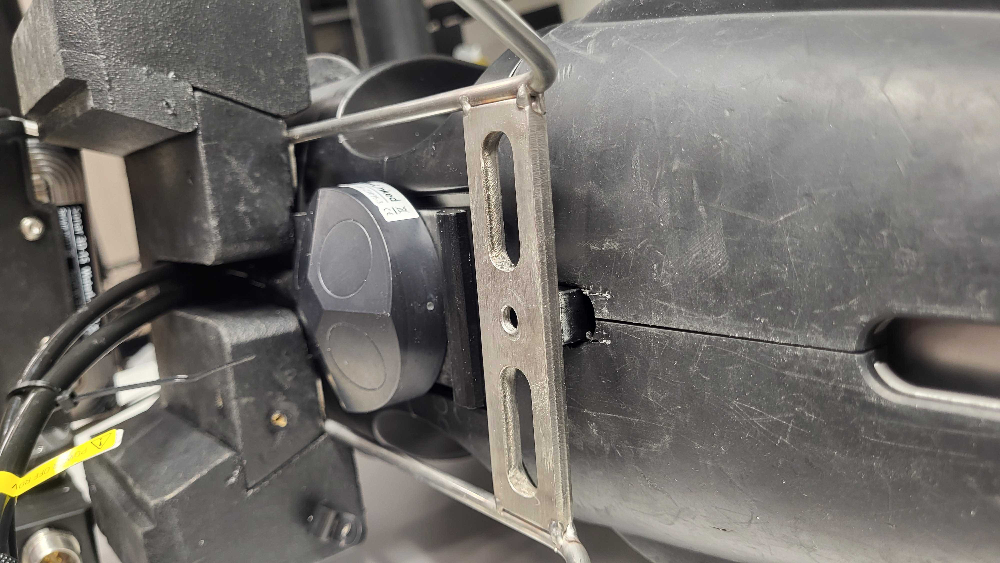{width="49%"}
    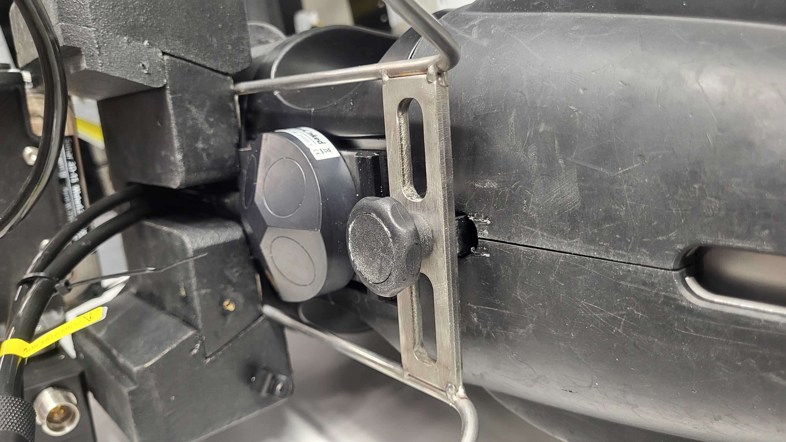{width="49%"}

5. **Connect the cables**

    Please make sure the cables are neatly attached, not blocking the view for either a Water Linked DVL or the Sonar 3D-15.

    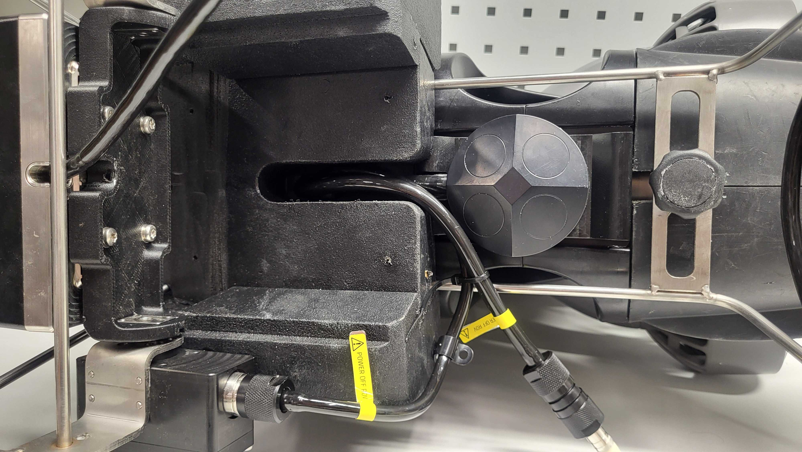{width="49%"}
    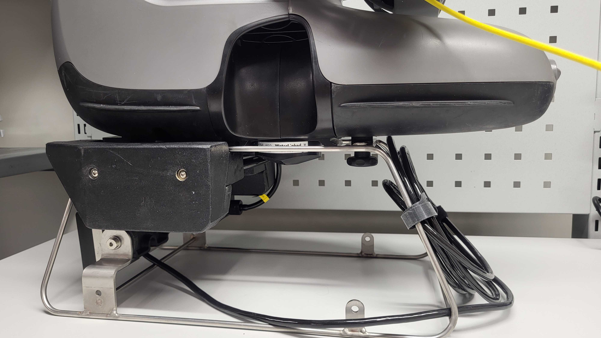{width="49%"}

!!! Warning
    Make sure the Blueye ROV is turned off and without power before connecting the cables.

!!! note
    Make sure the Sonar 3D-15 and cable are neatly and securely attached to the mount before use.

---

## Connection steps

### 1. **Turn on the Blueye ROV as normal**

Please see Blueye's manual for standard startup procedure.

!!! Warning 
    To avoid potential power hazard or errors, make sure every cable is well connected before you turn on the ROV. Do not connect sensors to the Blueye while the power is on.

### 2. **Connect your PC/Mac/phone to the Blueye Wi-Fi**

Most devices connected to the Blueye Wi-Fi—such as a PC, Mac, or smartphone—can display the Sonar 3D-15 GUI directly in their web browser.

To access the GUI, first go to the Wi-Fi settings of your selected device and connect to the Wi-Fi of the Blueye ROV with **SSID: “Blueye_XXXXXX”**. Use the default password **1234567890**.

!!! Note
    Accessing the sonar GUI in a browser on the same smartphone running the Blueye app will interrupt ROV control. To avoid this, use a separate device—preferably a computer—for a better user experience and larger screen view.

### 3. **Identify the IP-address of the Sonar 3D-15**

By standard, the local hostname of the Sonar 3D-15 is **waterlinked-sonar.lan** or **waterlinked-sonar.local**. Enter these in your web browser. 

!!! Warning
    Don't operate the Sonar 3D-15 out of water for any long periods.
    
    **Don’t click the green button “Enable Acoustics”** until the ROV is submerged in water to avoid overheating of the Sonar 3D-15. 
    
    Acoustics are always disabled when first booting up the Sonar 3D-15, and will be turned on once clicking this button. The Sonar 3D-15 will automatically turn itself off if too hot, but will take some time to cool down, it's best to avoid this happening.

If working, the browser will display a page like the one below — in this example, the Sonar 3D-15 is using the local hostname `waterlinked-sonar.lan` on Google Chrome on a separate computer.

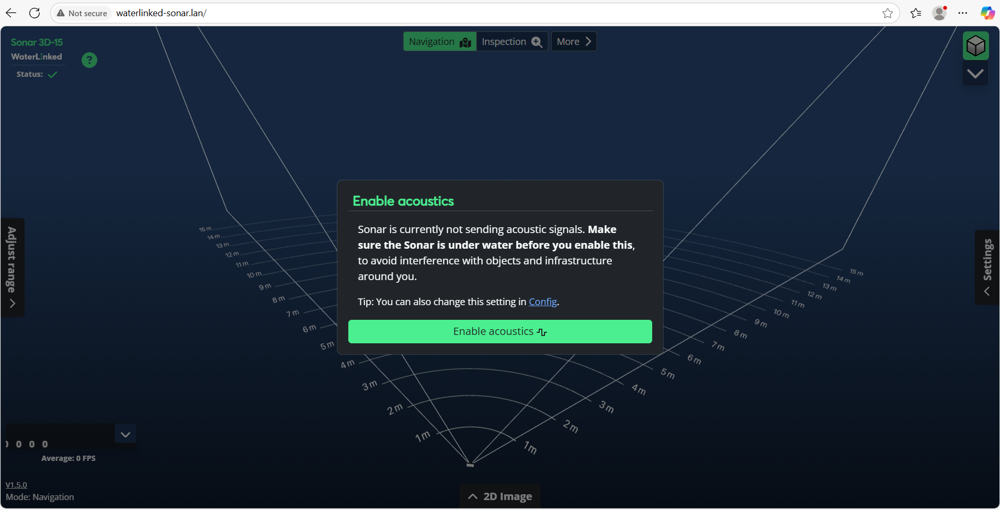

The following picture is an example of the Sonar 3D-15 GUI on a Android phone using the IP-address `192.168.1.233`.

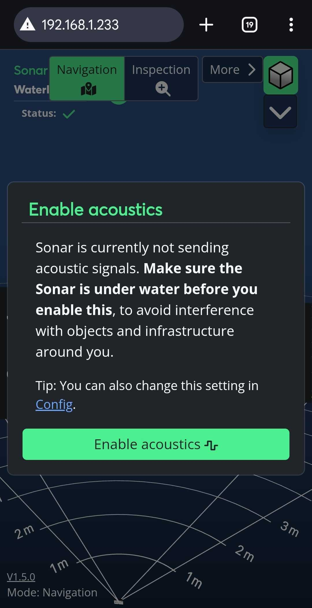{width="40%"}

!!! Note
    The Blueye might take a minute to boot up all the devices properly. If these local hostnames don't work immediately, it might be that the ROV just hasn't fully initialized them yet.

If these local hostnames don't show the GUI in your browser, the Blueye system has assigned the Sonar 3D-15 a different IP-address, and you need to determine which IP address has been assigned to the Sonar 3D-15. 

To do this, we recommend downloading an app on your phone to find all IP-addresses on the Blueye Wi-Fi. WiFiman by Ubiquiti is a good and free option, it can be downloaded from [Google Play](https://play.google.com/store/apps/details?id=com.ubnt.usurvey&pcampaignid=web_share) or [App Store](https://apps.apple.com/us/app/ubiquiti-wifiman/id1385561119). 

!!! Note
    There are many options of apps and programs that can find all IP-addresses on the network. Fing is another app that works, or you can also perform an IP scan on a computer.

Once installed and inside the WiFiman app, go to **Discovery** and scan the network. A list of all connected devices on the network will show, similar to the following:

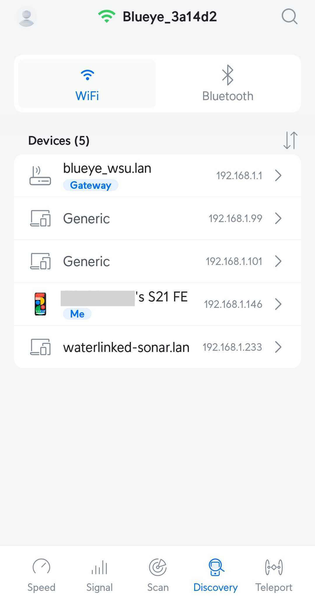{width="40%"}

Find the IP-address corresponding to the Water Linked Sonar 3D-15. In the picture, this is the **192.168.1.233**. Enter this IP-address into your browser to see the Sonar 3D-15 GUI.

### 5. **Put the drone in the water**

You are now ready to put the ROV in the water. 

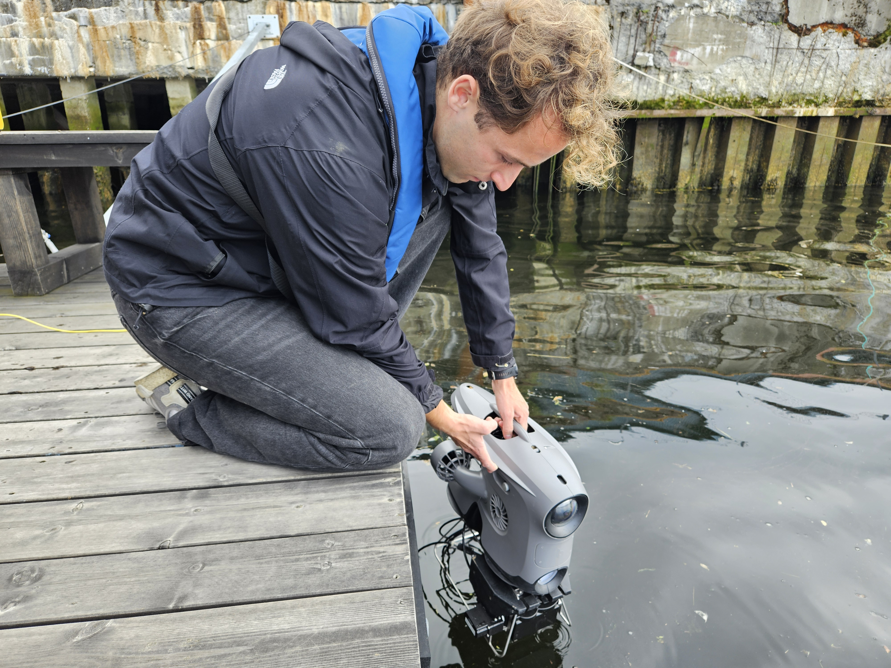

### 6. **Enable acoustics**

When ready, click the ”Start acoustics” button to initiate the Sonar 3D-15. It will display a point cloud in the GUI representing the 3D space  in front of the Sonar 3D-15. 

You are now ready to use the Water Linked Sonar 3D-15 with the Blueye ROV!