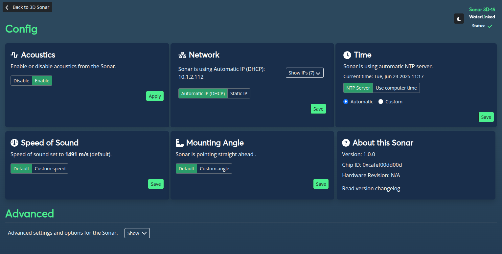
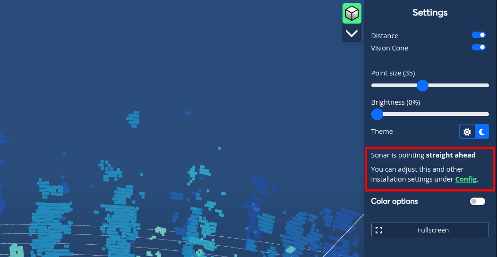
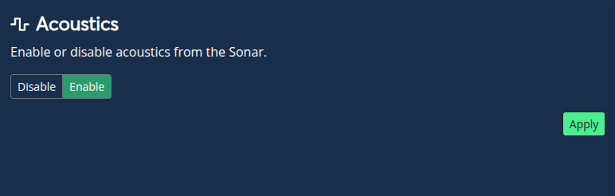
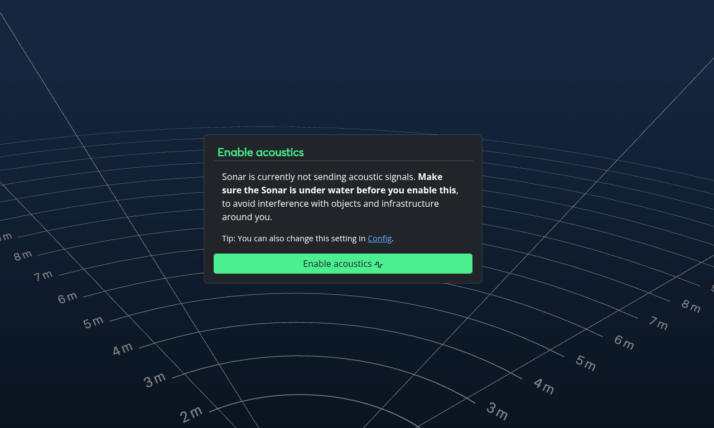
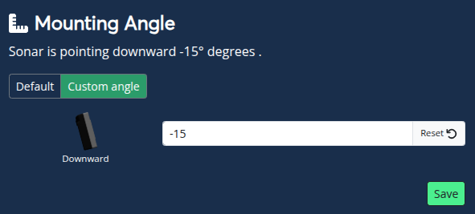
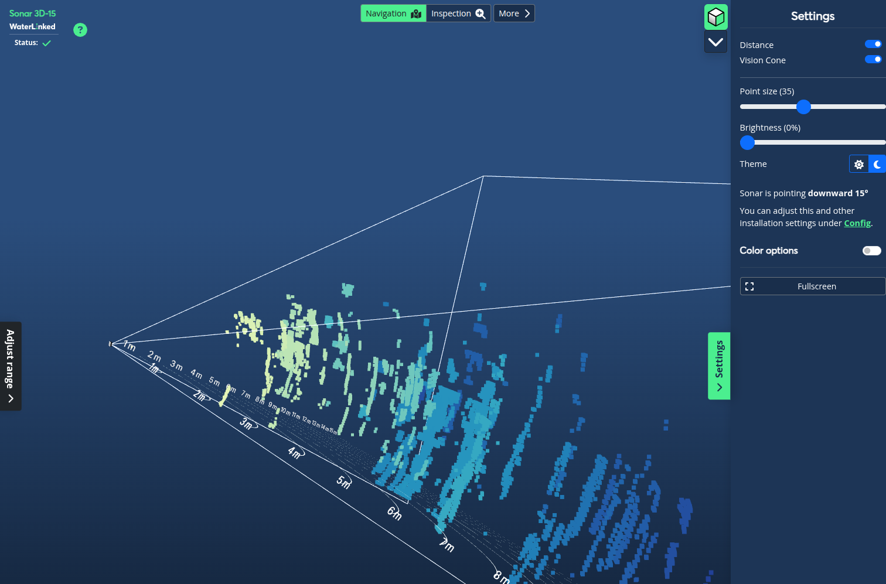
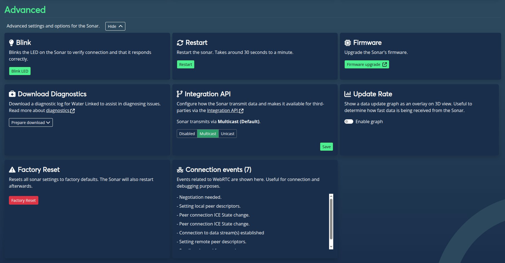
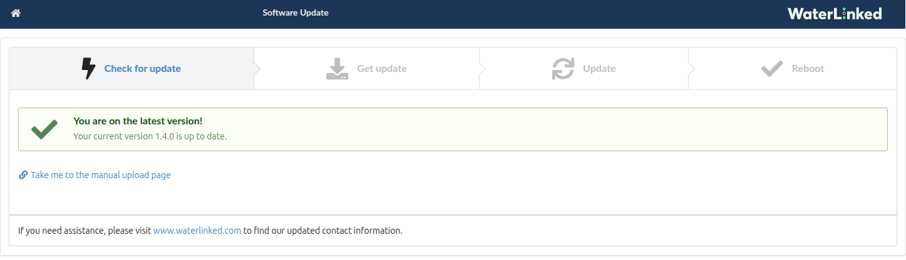
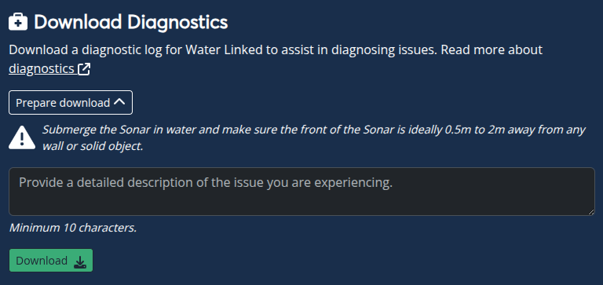
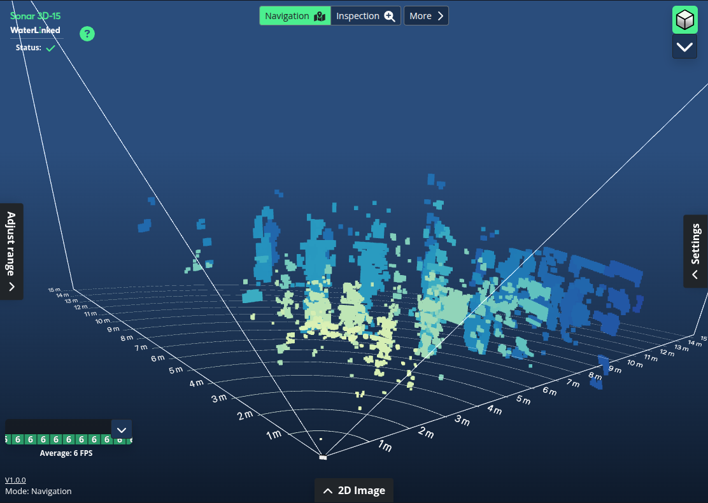

# Settings - Sonar 3D-15

## Introduction
A selection of different configurable settings to adjust and fine tune your experience with the Sonar 3D-15.

Access the configuration settings page from the "Settings" sidebar from the main page and following the "Config" link.

### Acoustics

Toggle whether or not to enable the Sonar to send acoustic signals. The 3D point cloud can only be shown when this is enabled.

!!! Important
    Ensure that the Sonar is under water before enabling acoustics, to avoid interference with objects and infrastructure around you.

Acoustics are disabled when the Sonar first boot. You'll see a message in the 3D view about enabling this.

### Network

Set how the Sonar 3D-15 is assigned an IP on your network: Automatic IP (DHCP) or Static IP. Default is Automatic IP. For further details regarding network setup, [see Networking](/Sonar-3d/Sonar-3d-15-networking/).

!!! Note
    Saved Network Settings are persistent, meaning it is kept on restart.

### Time

Set how the Sonar acquires date and time, NTP Server og Use Computer Time. Default is NTP server (automatic resolve). 

!!! Note
    Using computer time is only valid until the next restart of the Sonar. Saved Time Settings are persistent, meaning it is kept on restart.

### Speed of Sound

Change the speed of sound to reflect the surroundings of the Sonar. Default is **1491 m/s**. When using custom speed, the speed must be between 1000 and 2000 m/s.

### Mounting angle

Adjust how the Sonar is mounted on your vehicle / ROV. Valid values are from -90° (downwards) to 90° (upwards). Default mounting angle is 0° (straight ahead).

Changing this value will affect how the default rotation of the vision cone and Sonar model is shown in the 3D view.

## Advanced

Various advanced settings related to maintenance and troubleshooting the Sonar 3D-15. Toggle the display of these settings by clicking the "Show / Hide" button.

### Blink

The LED on the front of the Sonar blinks green for a set duration of time before turning off, confirming connection and operational status.

### Restart

Restarts the Sonar. Restarts usually take between 30 seconds to a minute to complete. 

!!! Note
    Some settings are preserved on restart. These are Network, Time and Integration API settings. Other settings may need to be set again after restart.

### Firmware

Allows for upgrading the Sonar's firmware. Click the button to open a new tab to the firmware updater. 

The firmware upgrader checks the currently installed version and determines if an upgrade is neccessary. If needed, follow the steps to complete the upgrade. Upon completion, the Sonar will reset all settings back to factory default and restart. Firmware upgrade can take a couple of minutes.

!!! Important
    Keep the Sonar submerged in water to ensure a proper operational temperature during upgrade. Failure to do so may render your Sonar in an inoperable state.

### Download Diagnostics

Generates a diagnostic log for Water Linked to assist in diagnosing issues.

Click the "Prepare download" button and ensure that the Sonar is submerged in water. Provide a detailed description of the issue in the text box and click "Download".

!!! Important
    The front of the Sonar should be 0.5m to 2m away from any wall or solid object to ensure ideal conditions before creating a diagnostic log. 

Submit a [support ticket](https://waterlinked.com/support) and attach the diagnostic log you just downloaded.

### Integration API

Change how the Sonar transmits data and at what address the integration API is available from. Options are Disabled, Multicast (Default) and Unicast.  [Read more about the Integration API](/sonar-3d/sonar-3d-15-api).

### Update Rate

Toggle the display of an update graph overlay in 3D view which shows how fast data is being received from the Sonar. The graph displays the last 10 seconds of updates along with an average frame rate. The graph can be toggled in the 3D view.

### Factory Reset
Reset all settings to factory defaults and restarts the Sonar. A confirmation is required before initiating a factory reset. 

### Connection events
Troubleshoot WebRTC connection issues between the GUI and the Sonar backend. These events relate to the UIs ability to communicate with the Sonar to establish the video streams, connection to the API, read system status and so on.