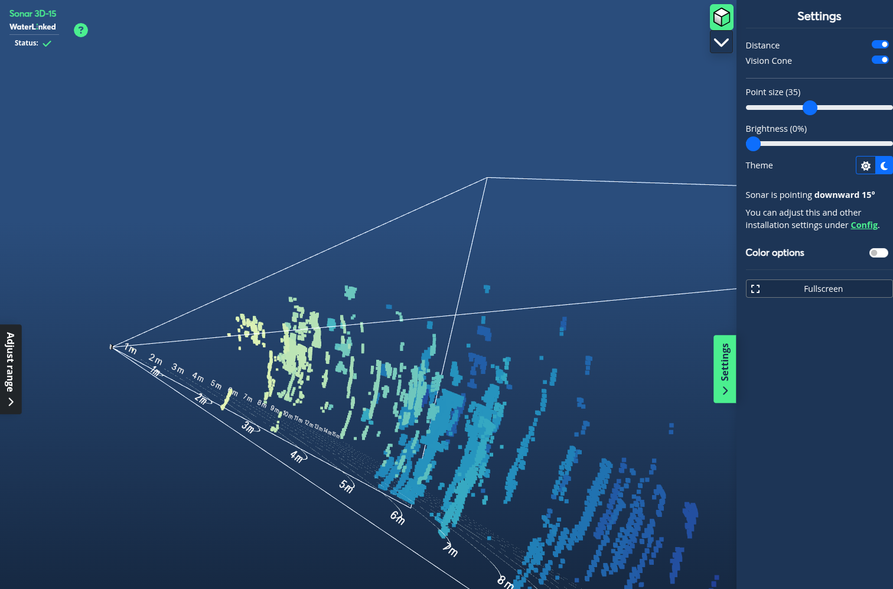

## Configuration Settings

A selection of different configurable settings to adjust and fine tune your experience with the Sonar 3D-15.

Access the config page from the "Settings" sidebar from the main page and following the "Config" link.

### Acoustics

Toggle whether or not to enable the Sonar to send acoustic signals. The 3D point cloud can only be shown when this is enabled. Ensure that the Sonar is under water before enabling this, to avoid interference with objects and infrastructure around you.

Acoustics are disabled when the Sonar first boots. You'll see a message in the 3D view about enabling this.

### Network

Set how the Sonar 3D-15 is assigned an IP on your network: Automatic IP (DHCP) or Static IP. Default is Automatic IP. For details regarding network setup and IPs, [see Networking](/sonar-3d/sonar-3d-15-networking/).

!!! Note
    Saved Network Settings are persistent, meaning it is kept on restart.

### Time

Set how the Sonar acquires date and time, NTP Server og Use Computer Time. Default is NTP server (automatic resolve). 

!!! Note
    Using computer time is only valid until the next restart of the Sonar. Saved Time Settings are persistent, meaning it is kept on restart.

### Speed of Sound

Change the speed of sound to reflect the surroundings of the Sonar. Default is **1491 m/s**. When using custom speed, the speed must be between 1000 and 2000 m/s.

## Mounting angle

Adjust how the Sonar is mounted on your vehicle / ROV. Valid values are from -90° (downwards) to 90° (upwards).

Changing this value will affect how the default rotation of the vision cone and sonar model is shown in the 3D view.

## Advanced

Various advanced settings related to maintenance and troubleshooting the Sonar 3D-15.

### Download Diagnostics

Generates a diagnostic log for Water Linked to assist in diagnosing issues.

Click the "Prepare download" button and ensure that the Sonar is submerged in water. Provide a detailed description of the issue in the text box and click "Download".

!!! Important
    The front of the Sonar should be 0.5m to 2m away from any wall or solid object to ensure ideal conditions before creating a diagnostic log. 

Submit a [support ticket](https://waterlinked.com/support) and attach the diagnostic log you just downloaded.

