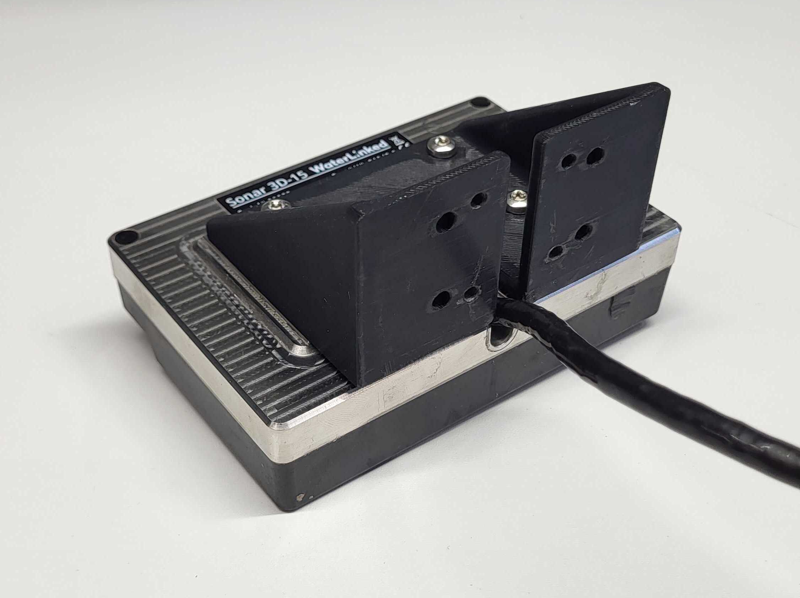

# Integrating onto Deep Trekker PIVOT ROV

---
## Introduction
This is a manual on how to install the Water Linked Sonar 3D-15 for the Deep Trekker PIVOT ROV. We recommend that you contact Deep Trekker to purchase the Sonar 3D-15, along with all parts to allow for installation on your Deep Trekker vehicle. You can contact [support@deeptrekker.com](mailto:support@deeptrekker.com) or [sales@deeptrekker.com](mailto:sales@deeptrekker.com) for this. Other documentation and information can be found at:

- [Deep Trekker PIVOT ROV Support](https://support.deeptrekker.com/vehicles/rovs/pivot/getting-started)


---

## What's in the box
The Sonar 3D-15 from Water Linked is normally shipped with an attached I/O Interface board. If you have bought the Sonar 3D-15 and Integration Kit from Deep Trekker, you will have a Deep Trekker (DT9636) connector instead of the I/O Interface. In that case, follow the integration instructions from Deep Trekker.


---

## What You’ll Need

To follow this guide, you will need the following:

- An Ethernet cable

    - *To connect the Deep Trekker Controller to your PC*

- Correct connector 

    - *Deep Trekker DT9636* 

- A mount (Sonar 3D-15 to ROV)

    - *An example can be downloaded from here: [3D step file](./stp_files/sonar_mount_1.stp)*

- Correct screws

    - *See the [Mounting](#mounting) section*


---

## Connector Setup
**Testing the Sonar 3D-15 Separately**

If the I/O Interface board is attached, the Sonar 3D-15 can be tested directly using an Ethernet cable and a power supply. If you wish to test the device on its own before integration, follow the general Quickstart tutorial, available here:  [Quickstart](https://docs.waterlinked.com/sonar-3d/sonar-3d-15-quickstart/).

**Connecting to Deep Trekker ROV**

The most common solution is to terminate a Deep Trekker connection port cable (DT9636) directly to the cable of the Sonar 3D-15. To do this, we recommend the following procedure:


1. **Remove the I/O board**. After this step, the I/O board is no longer needed for normal operation. The cables from the Sonar 3D-15 are shown in the picture below.

    {width="60%"}

2. **Terminate a Deep Trekker (DT9636) connection** to the Sonar 3D-15 cable using the table and pinmap below.

    | Sonar Cable Type | Sonar Cable Color | Pin Number 9636 Deep Trekker Connector 7-pole (Female) Rebuild Kit |
    |------------------|-------------------|------------------------------------------------------------------------|
    | DC-              | Black             | 1                                                                      |
    | DC+              | Red               | 2                                                                      |
    | RX+              | Green/White       | 6                                                                      |
    | RX-              | Green             | 5                                                                      |
    | TX+              | Orange/White      | 4                                                                      |
    | TX-              | Orange            | 3                                                                      |
    | NC               | NC                | 7                                                                      |


    {width="40%"}

3. **Add a waterproof seal** around the termination.

    {width="49%"}


!!! note
    The termination has to be waterproof and needs to withstand the depths of which you will be running your ROV. 

---


## Mounting
The Sonar 3D-15 needs to be physically attached to the Deep Trekker ROV. A possible option on how to do this will be listed here. There are many different approaches to achieve this, and this approach is only listed to provide an idea.

1. **Create or find a suitable mount**

    An example 3D step file of a mount is found here: [Download 3D step file](./stp_files/sonar_mount_1.stp)
    

    !!! Note
        Choose a 3D print material that can withstand the expected operating conditions.

2. **Identify the screws and mount to use**

    Use `[M4x (5.0 + X) mm]` screws to attach the Sonar 3D-15 to the mount, and use `[M4x (7.0 + X) mm]` screws with hex nuts and washers to attach the mount to the platform in front of the Deep Trekker. Exchange the *X* with the thickness of your mount.

    For example, for a 3.0mm thick mount *(as the given 3D print)*, the following is sufficient:
    
    - 4x `M4x8.0mm` screws
    - 4x `M4x10.0mm` screws
    - 4x `M4` Hex Nuts
    - 4x `M4` Washers 

    

    !!!Warning
        To avoid damaging the Sonar 3D-15, make sure the screws are not too long.

3. **Attach the mount to the Sonar 3D-15**

    


4. **Attach the mounted Sonar 3D-15 to the Deep Trekker ROV**

    We recommend putting the Sonar 3D-15 on the platform in the front for the Deep Trekker. In that way, the Sonar 3D-15 can be tilted by using the controller of the ROV, without blocking the Sonar 3D-15’s field of view.

    
    
    

!!! note
    Make sure the Sonar 3D-15 and cable are neatly and securely attached before use.
---

## Connection steps

### 1. **Connect to the bulkhead**

Connect the Sonar 3D-15 cable into one of your Deep Trekker ROV's free Ethernet ports on the Bulkhead of the DeepTrekker.


### 2. **Connect the top side**

Connect one end of an Ethernet cable to the Deep Trekker controller’s Ethernet port, and the other end to your computer.


### 3. **Turn on the drone**

Click the power button on the Deep Trekker controller and let the drone boot up. 


!!! Warning
    To avoid potential power hazard or errors, make sure all cables are securely connected before you turn on the controller. Do not connect sensors to the Deep Trekker while the power is on.

{margin:4px 0;" width="400px"}

### 4. **Access the Sonar 3D-15 GUI**
The Sonar 3D-15 GUI is accessed by entering the Sonar 3D-15's IP-address into the browser running on the computer connected to the controller.

Both the PC and Deep Trekker need to have DHCP enabled. This is standard for most computers and is normally enabled. But, to check if your computer has DHCP enabled, do the following:

---

**Checking DHCP for Windows:**

**Option 1:**

1. Open **Settings** > **Network & Internet**.
2. Click on **Ethernet**
3. Select your active connection.
4. Scroll to IP-address settings:
    - If it says **Automatic (DHCP)** → it's enabled. 
    - If it says **Manual** → DHCP is off.

**Option 2:**

1. Run the following command in the windows terminal
```sh 
ipconfig /all 
```

2. Look for the section **Ethernet adapter Ethernet** and the line **DHCP Enabled** (green arrow)

3. If **DHCP Enabled** is set to **Yes**, then DHCP is enabled.

    

---

**Checking DHCP for Linux:**

1. Run the following in the terminal:

```sh 
for iface in $(ip -o link show | awk -F': ' '{print $2}'); do
  echo "Interface: $iface"
  ip addr show "$iface" | grep -q dynamic && echo "  --> DHCP detected" || echo "  --> Static or unknown"
done

```


If you see **--> DHCP detected**, your PC has DHCP enabled and you are ready to continue.

If DHCP is disabled, please enable this on your computer. 


---

**Finding and connecting to the IP-address of the Sonar 3D-15**

You need to determine which IP-address has been automatically assigned to it by the Deep Trekker system. Once located, entering it into your browser will display a page like the one below — in this example, the Sonar 3D-15 is using `10.77.0.7`.


!!! Warning
    Don't operate the Sonar 3D-15 out of water for any long periods. To avoid overheating of the Sonar 3D-15, **don’t click the green button “Enable Acoustics”** until the ROV is submerged in water. 
    
    Acoustics is always disabled when first booting up the Sonar 3D-15, and will be turned on once clicking this button. The Sonar 3D-15 will automatically turn itself off if too hot, but will take some time to cool down, it's best to avoid this happening.


To figure out what the correct IP-address is, do the following:

1. **Get an overview of the network**

    Click **Menu -> Settings -> Network**. This will show a list of the IP-addresses of the connected sensors on the DeepTrekker. At this time, the Sonar 3D-15 does not appear in the list, even when connected.

    {width="49%"}
    {width="49%"}
    {width="49%"}
    {width="49%"}
    {width="98.5%"}


2. **Test and find the IP-address**

    The ROV usually assigns connected devices using a base IP-address, in this example, `10.77.0.X`. It's possible your ROV has a different base, use the one shown on your Controller.
    
    To locate the Sonar 3D-15's IP-address, test an address that doesn't appear in the network list — preferably one just above the highest one in the list. 

    - For example, if the highest IP-address on the list of the Deep Trekker Controller Network section is the DVL A50 with `10.77.0.6`, try accessing the Sonar 3D-15 with `10.77.0.7` or `10.77.0.8` in the browser
    - Or, if all addresses between `10.77.0.1` - `10.77.0.7` are on the list, except for `10.77.0.4`, try the IP-address `10.77.0.4` for the Sonar 3D-15.

    

!!! Tip
    You can also access the GUI on the Sonar 3D-15's fallback address `192.168.194.96`,this is explained in more detail in the general Quickstart guide, which can be found at [Quickstart](https://docs.waterlinked.com/sonar-3d/sonar-3d-15-quickstart/) .

### 5. **Put the ROV into the water**

You are now ready to put the ROV into the water. 


### 6. **Enable acoustics**

When ready, click the ”Start acoustics” button to initiate the Sonar 3D-15. It will display a 3D point cloud in the GUI representing the area in front of the Sonar 3D-15.

You are now ready to use the Water Linked Sonar 3D-15 with the Deep Trekker ROV!

