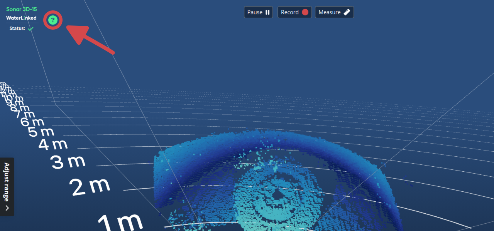
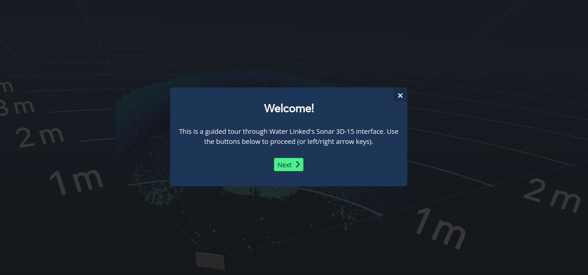
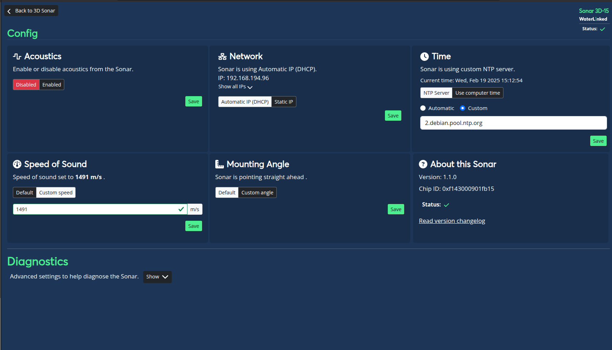
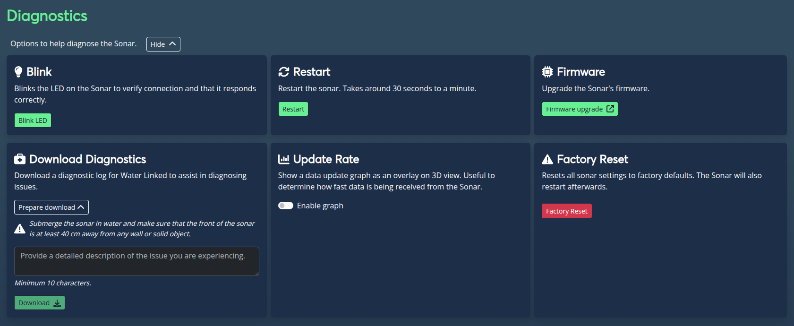

# GUI

The GUI is designed to be user friendly with a clean an intuitive set of controls.

When you first start the Sonar 3D-15 GUI you will be greeted with a view showing the 3D point cloud and various settings. To get familiar with the interface, click the  icon (help overlay).
The 3D view can be controlled via mouse and keyboard, or touch controls.

The help overlay walks you through common features of the Sonar 3D-15 GUI.

## Config View

You can acccess the config via the Settings sidebar and clicking "Config". This allows you to configure common settings of the Sonar. Note that all configurations are reset to default on restart.

### Enable/disable acoustics
Enable or disable acoustics from the sonar. Acoustics is disabled when first booting up the sonar. Make sure the sonar is submerged in water before enabling this.
### Network config
Customize IP and network assignment for the sonar.
### Time config
Change Time servers.
### Speed of sound config
Change speed of sound according to your environment.
### Mounting angle offset
Specify the sonar's mounting angle in pitch direction. This setting only affect the 3D point cloud view.
### About the Sonar
Details what version and chip ID your sonar is running on along with the option to read the changelog.

--- 
## Diagnostics

The diagnostics view provide different options to help diagnose the sonar. Toggle the display of these settings with the `Show/Hide` button next to the section.

### Blink LED
Blinks the LED on the Sonar to verify connection and that it responds correctly.
### Restart
Restart the sonar. Takes around 30 seconds to a minute.
### Update firmware
Upgrade the Sonar's firmware.
### Download diagnostics
Diagnostics allows for downloading a log containing information from the Sonar that can be used by Water Linked in troubleshooting issues. During diagnostics data collection the point cloud imagery will be paused.

To ensure proper data collection, submerge the sonar in water and make sure that the front of the sonar is at least 40 cm away from any wall or solid object. Also provide a description for your setup and environment.

Submit a [support ticket](https://waterlinked.com/support) with the diagnostic log file attached

### Update rate
Show a data update graph as an overlay on 3D view. Useful to determine how fast data is being received from the Sonar.
### Factory reset
Resets all sonar settings to factory defaults. The Sonar will also restart afterwards.
