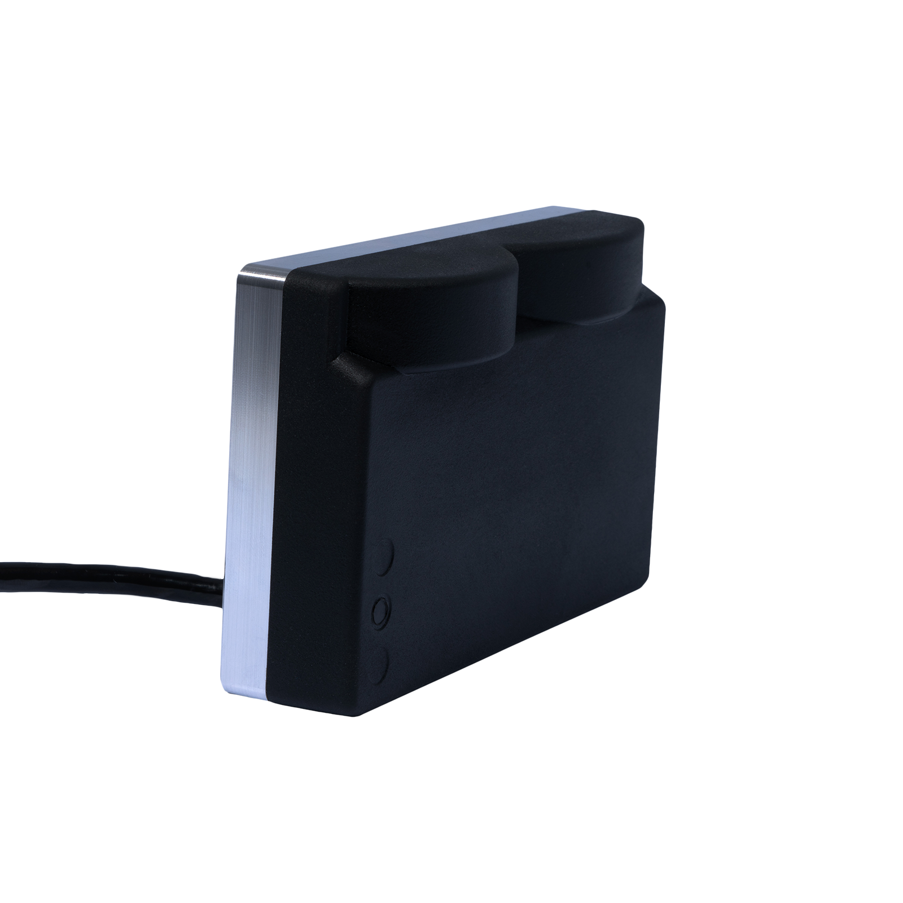

# Sonar 3D-15

The Water Linked Sonar 3D-15 is an advanced 3D multibeam imaging sonar designed to enhance underwater exploration and navigation. 

With real-time 3D imaging capabilities, it provides a comprehensive view of submerged environments, even in low-visibility conditions. 

