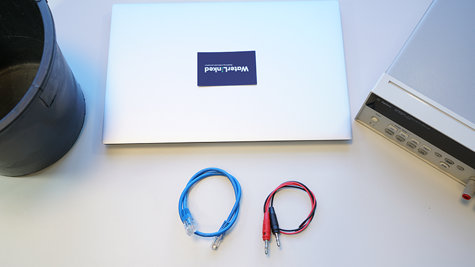
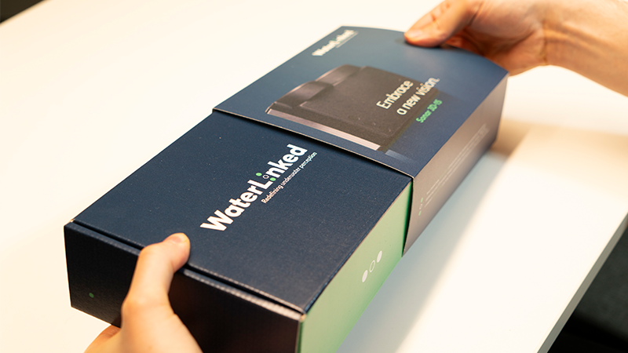
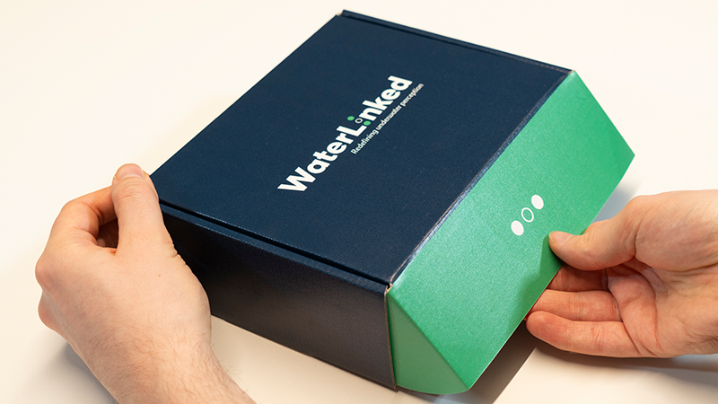
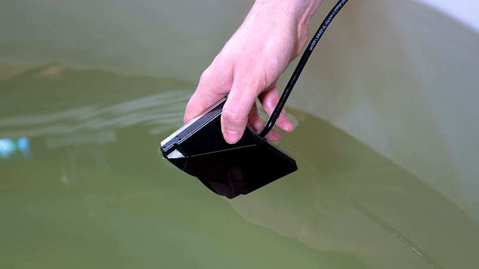
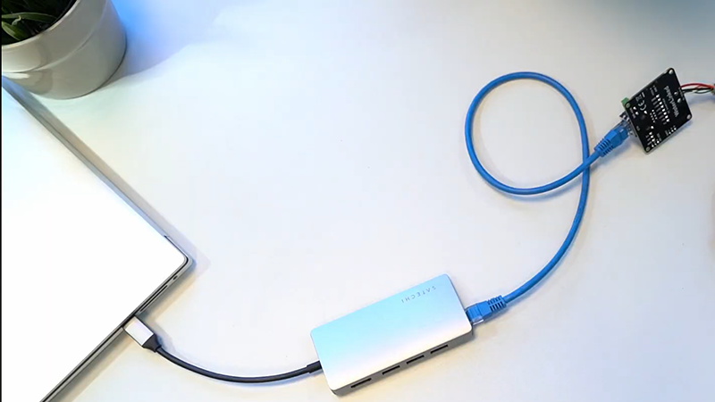
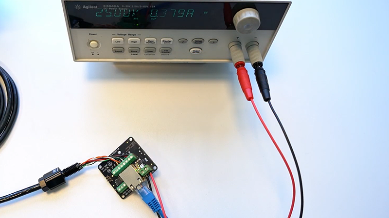
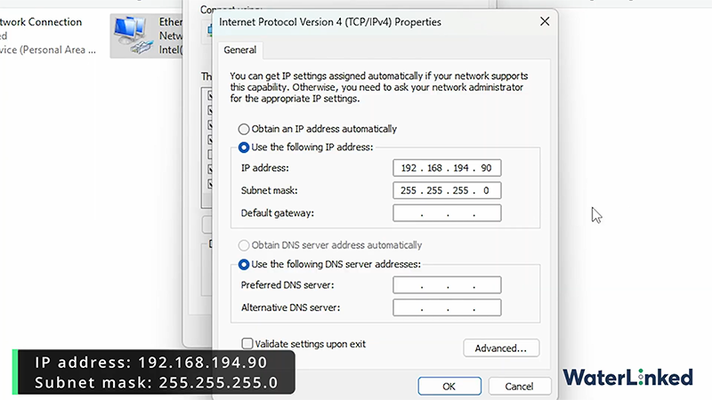
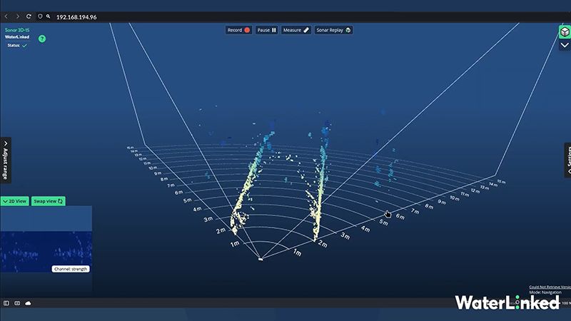

# Sonar 3D-15 Quickstart

This guide will help you connect and access the Sonar 3D-15 GUI so you can explore its features. You can follow the steps below or watch the accompanying video.

  <iframe
    src="https://www.youtube.com/embed/IxMZxHuacdQ?si=6m16D2UlgL0NQ6lD"
    title="YouTube video player"
    frameborder="0"
    allow="accelerometer; autoplay; clipboard-write; encrypted-media; gyroscope; picture-in-picture; web-share"
    referrerpolicy="strict-origin-when-cross-origin"
    allowfullscreen>
  </iframe>

_Requirements:_

- Water Linked 3D sonar
- Power source (10-30V DC, 60W surge)
- Power connector
- Computer
- Ethernet cable

## 1. Unbox and place in water
Unbox the Sonar 3D-15 and place the Sonar 3D-15 in a water container (e.g., a bucket or tank). Avoid getting water on the I/O board.

{width="49%"}
{width="49%"}

## 2. Connect the Ethernet cable
Plug one end of the Ethernet cable into your computer's Ethernet port, and connect the other end to the Sonar's I/O board.  

## 3. Connect a power supply and boot the Sonar
- Connect your power supply to the I/O board. Use a power supply capable of delivering 60W (surge) at 10-30V (20+ V recommended).
- Turn on your power supply. Your Sonar 3D-15 takes about 30 seconds to boot.

## 4. Configure your computer’s IP
Assign your computer an IP address in the `192.168.194.x` range (e.g.: `192.168.194.90` with netmask `255.255.255.0`).
!!! Note
    *Configuring network varies between operating systems and versions. Please search the web on how to do this for your operating system. Feel free to contact us for support.*

See more details in the [Networking section.](sonar-3d-15-networking.md)

## 5. Access the Sonar GUI
Open up your web browser (e.g.: Chrome) and enter the fallback IP address `192.168.194.96`. You should now be able to see and use the Sonar 3D-15 GUI.

## Need help?
Check out the [FAQ!](sonar-3d-15-faq.md)
