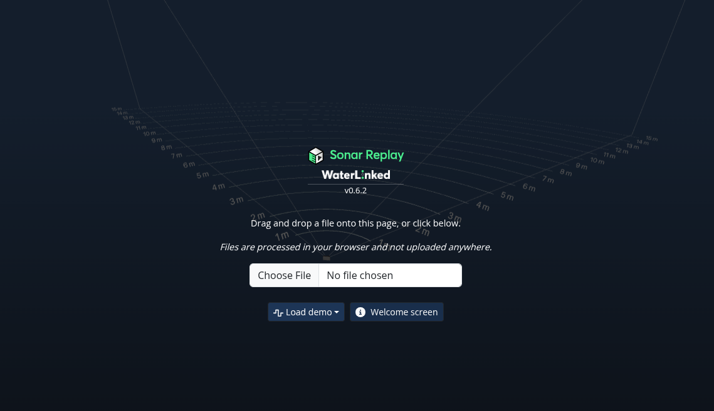
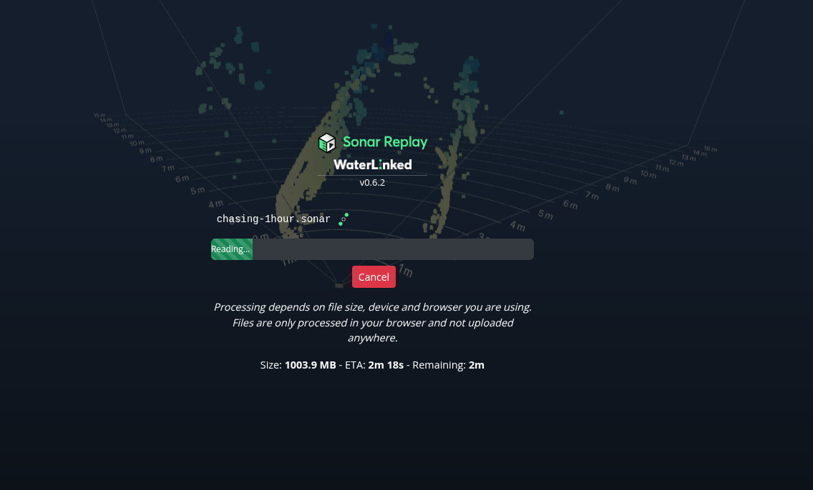
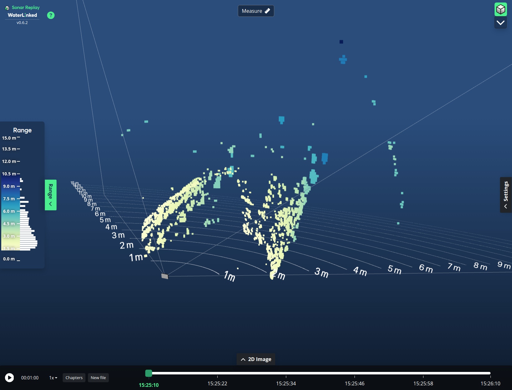
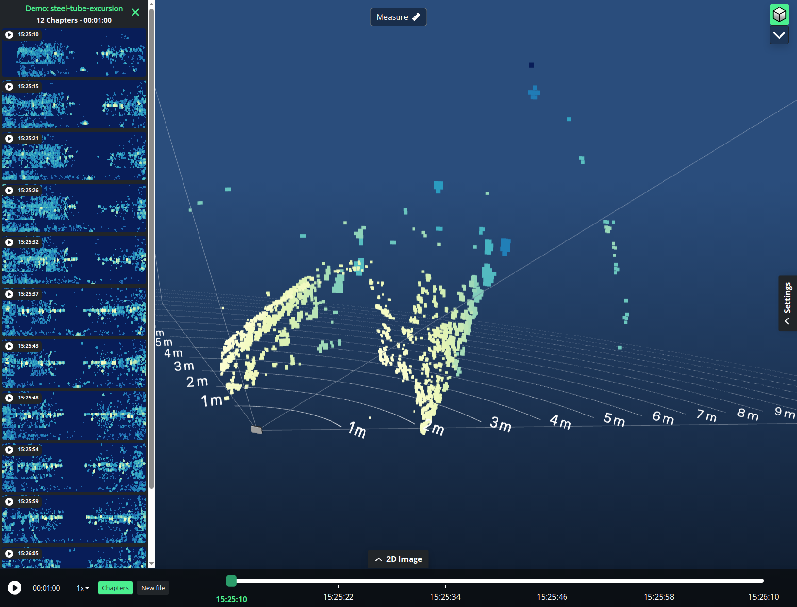
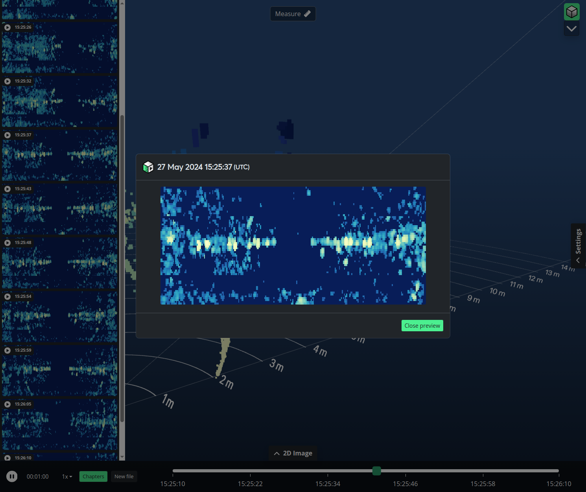
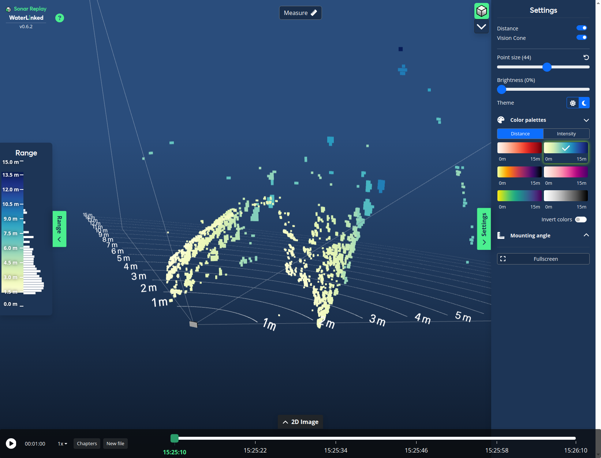
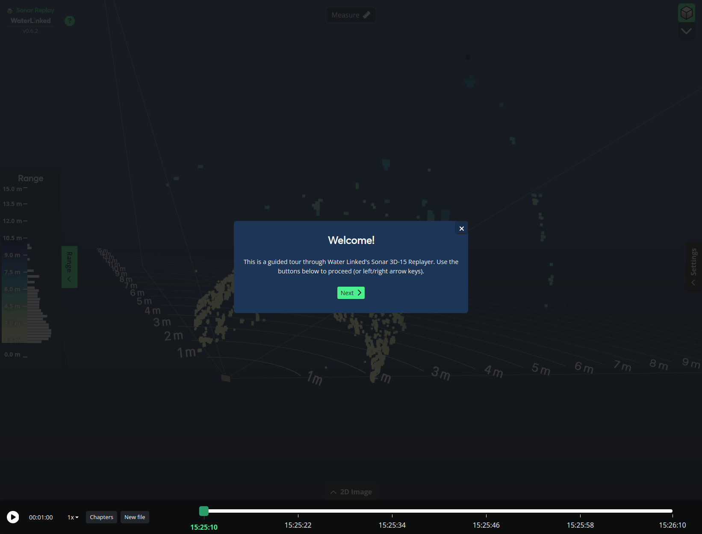

# Sonar Replay

Playback recordings taken with the [Sonar 3D-15](https://waterlinked.com/3dsonar) directly in your browser. You can access [Sonar Replay here](https://sonar.replay.waterlinked.com). The interface is similar to that of the Sonar 3D-15, but with some changes.

All processing is done in your browser and not uploaded anywhere. 

!!! Note
    Sonar Replay is still in development. Some features may not be fully functional or implemented yet.

Select a file to process by clicking the file input or by dragging and dropping a file onto the browser window. Alternatively use one of the provided examples by clicking "Load demo" and selecting a recording. Processing time depends on file size, device and browser you are using. While processing, an estimated remaining time is shown.

!!! Note
    We recommend recordings smaller than 300 MB for the best experience.

## Playback
Once processing is complete, the 3D point cloud is shown and playback will start immediately. Scrub through the recording using the playback slider, pause, adjust playback speed or get an overview of the recording with "Chapters".

## Chapters
Sonar Replay will automatically create chapter previews of the provided recording. Access this by clicking the "Chapters" button or by hitting <code>C</code> on your keyboard. Note that all recorded timestamps are in UTC (Coordinated Universal Time).

!!! Tip
    Quickly jump to a chapter by clicking the preview image.

Chapter preview can be expanded to a larger version by clicking the magnifying glass icon that appears when hovering the chapter preview. 

## Adjust settings
Much like the real Sonar 3D-15, settings can be adjusted to better fit your use case and observe the recording. From here settings like point size, color palette and toggling elements in the 3D view can be adjusted.

## Help
Get a quick overview of all main parts of the interface by clicking the <code>?</code> (Question) icon top left or by hitting <code>H</code> on your keyboard.

