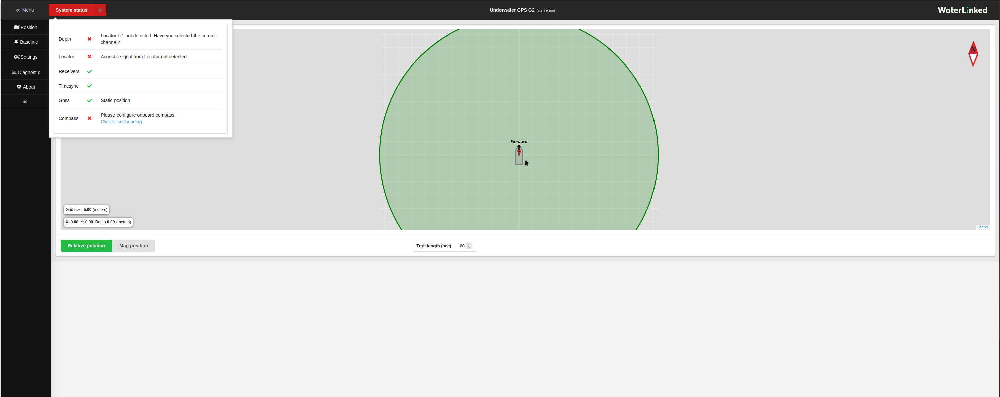
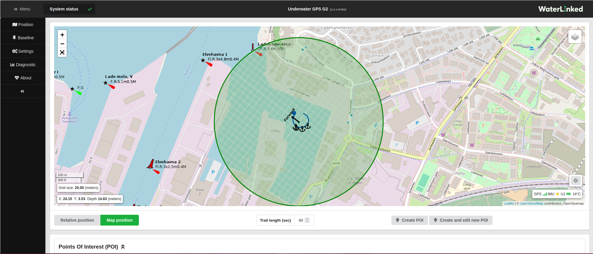
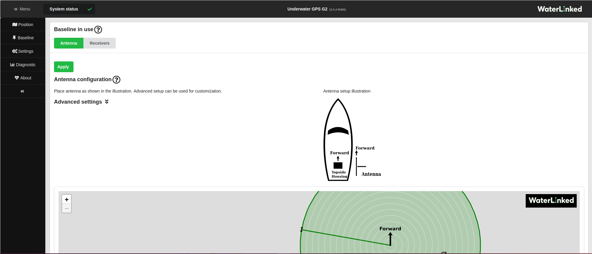
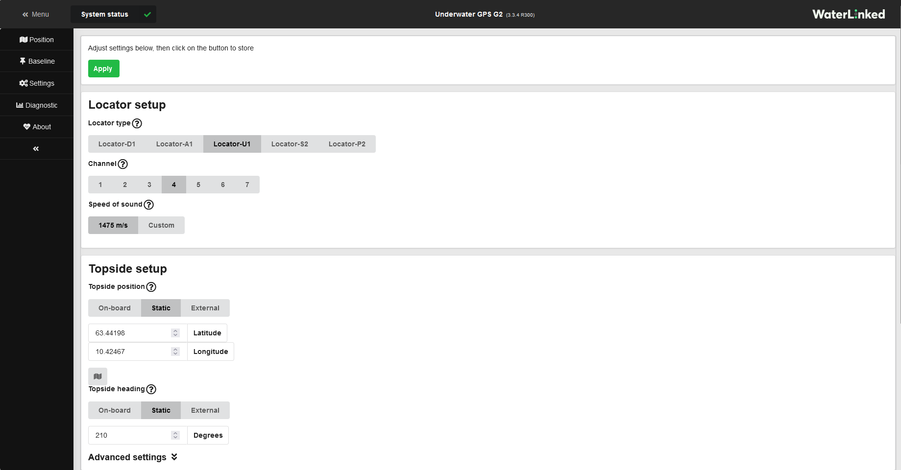
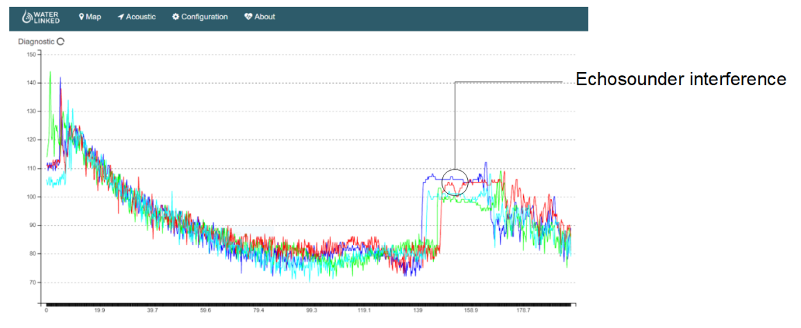

# UGPS GUI
The UGPS comes with an easy to use Graphical User Interface that can easily be reached via wifi or ethernet.
See [Networking](../network-settings.md) for details on how to connect to the UGPS's GUI.

The Underwater GPS GUI is web based. Using your favorite web browser, go the IP address as defined [here](../network-settings.md). We currently support and recommend Chrome, Firefox, Safari and Edge.

!!! Attention 
    Internet Explorer is not supported as of now.

!!! Tip
    We offer a live [demo](https://demo.waterlinked.com) of the GUI of the UGPS G2 system. It runs on simulated data, designed to illustrate various GUI features; this data is not necessarily realistic in all aspects!

The system does not need to be fully set up to access the user interface. Only the topside needs to be powered on. You will however get some status warnings as long as the topside is not able to detect any locator. 

The first thing you see when opening up the GUI is the Position window with the relative position view, and the status warnings. 
To the **left** there is a **menu bar** where you can access all features and settings.

!!! Note 
    For more information about the warnings, see: [**warnings**](../interface/warnings.md)

## Position
This window shows you the werabouts of the locator in relation to the topside. You can switch between relative position and map position. 

!!! Note
    You will need **internet access** on the computer that are showing the GUI, if you also want to see the map and not only the relative position of the locator. This is because the map is fetched from the internet. 

### Relative position
The relative position view shows you the location of the locator in relation to the UGPS topside box.

### Map position
To be able to get a map position view, your computer must have internet access, as the map is downloaded from the internet. The map view gives you the position and heading of the topside and the position of the locator. 

In this view you can also mark your own *points of interests*, either if you know the latitude and longitude of the destination you seek, or if you want to mark a point you pass along the route so that you can go back later.

## Baseline
The baseline is the configuration of your systems settings based on your hardware setup. In this window you select your baseline setup, whether you are using an antenna or loose receivers, and their placement with regard to the topside. 

In the tab at the top select **antenna** or **receivers** according to whether an [antenna](../antenna.md) or loose [receivers](../receiver-d1.md) are used, and enter your systems baseline configurations. See [System configurations](../ugps-sysconfig.md) for details on how to configure your systems baseline in the GUI.

## Settings
In Settings, you configure which locator you are using and if your topside is statically mounted on a dock or if it is onboard a boat. If you are using a locator-U1, you need to configure which channel the locator is on. 

If the topside is mounted in a dynamic environment, you will get the option to set your systems heading. In this case you must use a good compass and enter the heading into your system regularly. The compass of a mobile phone is not accurate enough.

You can also choose if you want to use metric or imperial units.

In the advanced settings option you can choose your preferred connection method.

!!! Note
    Remeber that the locator channel has to be set both in the settings menu, and also physically on the locator-U1.

See [System configurations](../ugps-sysconfig.md) for details on how to configure your systems settings in the GUI.

## Diagnostics

In the Diagnostic window you can see the locator position in numbers, together with a graphical view of the signal strength and system noise. This allows you to analyse your systems performance. 

In the diagnostic plot you should see the signal from all 4 Receivers. The signals should be well above the noise floor.

### Interference

Acoustic interference can be observed in the diagnostic plot. Echo sounders from your boat or nearby boats typically appears like burst noise.

If it is coming from your boat, try to turn off the echo sounder to improve position accuracy.
In case of interference from other acoustic sources, use the GUI to try other channels to avoid the interference.

!!! Tip
    Typically, NSD (_Noise spectral density_, displayed in the [Diagnostic](../underwater-gps/interface/ugps-gui.md#diagnostics) pane of the GUI) is around -100 dBm (in the units of version 3.3.0 or later of the software; 15 nV/sqrt(Hz) in the units of earlier software versions), or a little higher or lower. If it is much higher than this, it is likely that there is acoustic interference in the chosen channel, and a different channel should be tried.

    Note in particular that acoustic devices quite commonly operate at frequencies lying in Channel 1.

!!! Tip
    If the NSD values are normal, signal quality is mainly indicated by the RSSI values (_Received signal strength indicator_, displayed in the [Diagnostic](../underwater-gps/interface/ugps-gui.md#diagnostics) pane of the GUI). As long as the RSSI values are not too far below the NSD values, the signal strength should be at usable levels.

    The UGPS system uses advanced signal processing techniques and can work even with rather weak signals, but an RSSI of -125 dBm or so (in the units of version 3.3.0 or later of the software; -45 dBnW in the units of earlier software versions) is around the lowest possible for an NSD of roughly -100 dBm.

    Typically one can expect a decrease in signal strength of around 6 dB for each doubling of distance due to spherical spreading, plus a little more due to additional absorption.

### Diagnostic report
At the bottom of the page there is an option that allows you to record a diagnostic report.  
If you are experienceing any issues with your system, record a diagnostic logfile. The file should preferably be recorded in the moment as your system is failing. Then contact Waterlinkeds technical support through the [support portal](https://waterlinked.com/support). Attach the diagnostic report file you recorded to your request. The file contains valuable information that will help the support team analyse your system. 

!!! Note
    The logfile must be downloaded to your computer and sent to customer support as an email attachment.

## About
The about page tells you which software version that is currently running on your system. If there is a new update available you can easily download and install from this page. But the topside must be turned on and connected to the internet for this option to be available. If not you will have to do a manual upgrade. See [Software update](../sw-update.md) for details on how to do this. 

It is always recommended to use the latest sw update.

!!! Tip
    If a new software update is available, an exclamation mark will be visible next to the Waterlinked logo in the GUI. 

