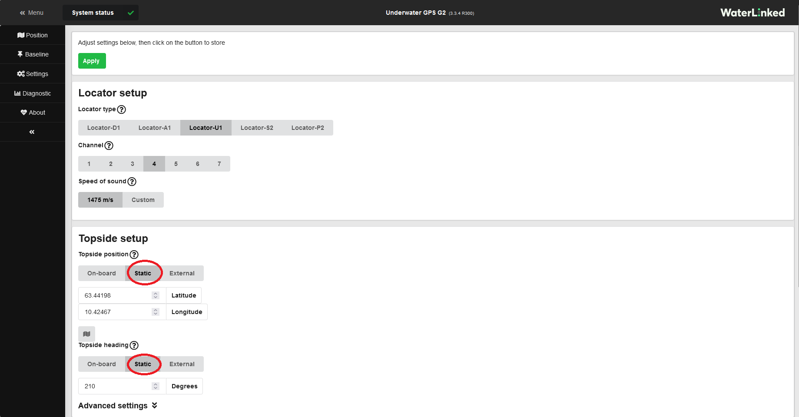
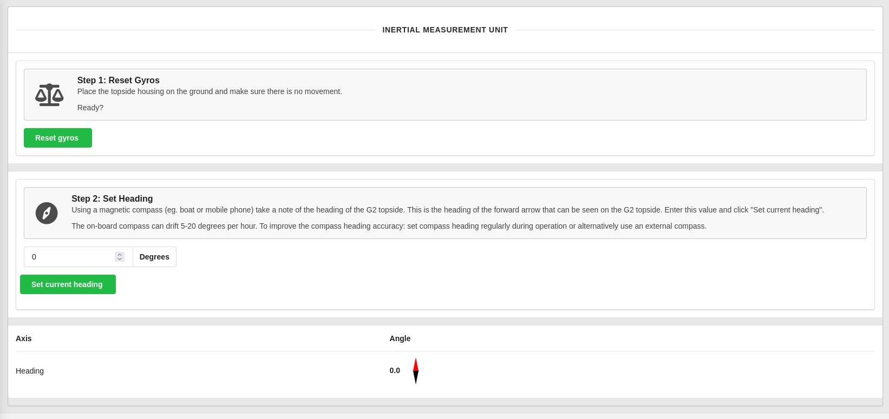

# Adjusting your UGPS systems configuration and settings
The setup in the GUI needs to mirror your actual setup in the real world for your positioning information to be correct. In the GUI there are two systems that needs to be adjusted; the [Baseline](../underwater-gps/interface/ugps-gui.md#baseline) and the [Settings](../underwater-gps/interface/ugps-gui.md#settings).

In the Baseline window in the GUI, you adjust the placement of your antenna/receivers in relation to the topside box. In the Settings window you choose which locator you are using and the placement of the topside in the environment.

## Baseline settings
Go to [Baseline](../underwater-gps/interface/ugps-gui.md#baseline) from the left menu in the GUI.  
In the tab at the top select **antenna** or **receivers** according to whether an [antenna](../underwater-gps/antenna.md) or loose [receivers](../underwater-gps/receiver-d1.md) are used.

In the receiver view, in the graphical configuration panel, you either drag and drop the receivers to their actual position in relation to the topside, or you fill in the position manually in the input fields below the panel. (You might need to drag the receivers apart for the manual input fields to become visible) Remember to fill inn the receivers depth.

In the antenna view you need to open Advanced Settings to fill in the position of the antenna in relation to the topside.

Improved positioning will likely be obtained by **limiting the search area** : Restrict the search area as far as possible by dragging and dropping the arrows in the graphical configuration panel.

## Locator and topside settings
Cofigurations of the topside and locator settings is conducted in [Settings](../underwater-gps/interface/ugps-gui.md#settings), from the left menu in the GUI.

### Locator settings

Select the type of locator ([U1](./locators/locator-u1.md), [A1](./locators/locator-a1.md), or [D1](./locators/locator-d1.md)) which you are using, and which [channel](#channel-overview) you wish to use.

!!! Note
    If using the [U1](./locators/locator-u1.md) locator, the channel must match the rotary switch at the back of the U1 (screw the lid completely off to access the switch).

!!! Note
    If using the [A1](./locators/locator-a1.md) locator, the depth of the locator must be inputted by means of the UGPS [API](./integration/api.md).

#### Channel overview

The frequency bands of the available channels are as follows. Lower frequency typically corresponds to greater range due to less acoustic absorption, though there are other factors involved: if you experience issues with signal quality (low RSSI or high NSD), try a different channel. Often channel 3 is recommended.

| From (kHz) | To (kHz) | Channel |
|------------|----------|---------|
| 31.25      | 62.5     | 1       |
| 62.5       | 93.75    | 2       |
| 93.75      | 125.0    | 3       |
| 125.0      | 156.25   | 4       |
| 156.25     | 187.5    | 5       |
| 187.5      | 218.75   | 6       |
| 218.75     | 250.0    | 7       |

### Topside settings
The default source for the topside position and heading is *On-board*. This configuration should be chosen if the topside is located in any dynamic environment, like on a boat or similar. 

If the topside unit/antenna is at a globally stationary position (like a jetty) the *static* configuration of position and heading will give best accuracy of the system. Below you can see how the position and heading is set to static. Clicking on the map button opens a map window to help you input the static position.

#### IMU calibration
The link "Onboard IMU calibration" takes you to a window where you can reset the gyros and set the heading manually. 

It is advisable to reset the gyros before every use. Place the topside on a static horisontal area and press "Reset gyros.

The topsides heading has to be set manually. Use a decent compass and enter the heading in the heading filed, and press "set current heading". 

!!! Note
    When you are using On-board positioning the heading has to be set periodically, as the IMU will drift over time. 

For best performance on boats or similar, with a moving topside unit, we recommend to use an exteranl input of heading data (e.g. from a GPS compass) as well as global position data. An external device will likely be more accurate than the topside unit's built-in GPS receiver and IMU. For a thorough description on how to do this, see [External Compass](../underwater-gps/integration/external-gps.md)
#### User preferences

Select whether to use metric or imperial units, and/or if you would like a dummy boat to be displayed on the map and receiver configuration pages.

### Advanced settings
Advanced settings allows you to configure ethernet and wifi.

